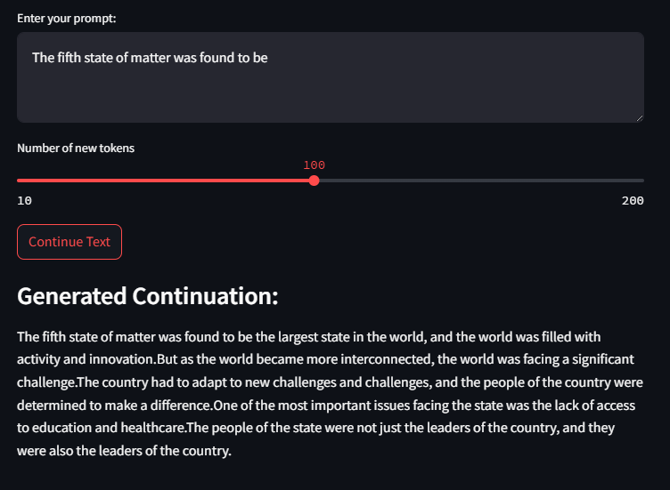

# SmolLM2-135M Replica

This repository contains a replica implementation of the SmolLM2-135M model, based on the original model architecture from [@huggingface/smollm](https://github.com/huggingface/smollm). The implementation was recreated using the configuration specifications found in the pretraining directory of the original repository. The model has been trained on the cosmopedia-v2 dataset, which is a subset of the smollm-corpus dataset. The training was done in a Linux environment in an EC2 instance.

The model was trained for 5000 steps, then a checkpoint saved, followed by 50 more steps. Afterwards, the model was further trained till 10000 steps in all. 

The model can be tried on a demo app in hugging face at https://huggingface.co/spaces/atiwari751/smollm2-135M-replica. 

## Model Architecture

The model follows a decoder-only transformer architecture with the following specifications:
- Total Parameters: 134,515,008
- Hidden Size: 576
- Intermediate Size: 1536
- Number of Hidden Layers: 30
- Number of Attention Heads: 9
- Number of Key-Value Heads: 3 (Grouped Query Attention)
- Maximum Sequence Length: 8192
- Vocabulary Size: 49152

Key architectural features:
- RMSNorm for layer normalization
- Rotary Position Embeddings (RoPE)
- SwiGLU activation in MLP layers
- Flash Attention for efficient attention computation
- Gradient checkpointing for memory efficiency

## Dataloader

The implementation uses a custom `CosmopediaDataLoader` that:
- Streams data from the Cosmopedia-v2 dataset
- Implements efficient token buffering with prefetch
- Maintains sequence coherence during batching
- Handles dynamic buffer refilling
- Provides configurable batch size and sequence length
- Includes random shuffling at sequence boundaries

## Performance Optimizations

Several optimizations have been implemented to improve training efficiency:
- Gradient checkpointing to reduce memory usage
- Mixed precision training with automatic mixed precision (AMP)
- Efficient token buffering in dataloader
- Flash Attention for faster attention computation
- Grouped Query Attention for reduced memory footprint
- Compiled model using torch.compile()
- Dynamic device placement (GPU/CPU) for flexible deployment

## Training

The training implementation includes:
- Regular model checkpointing
- Lightweight checkpoint conversion for deployment
- Gradient scaling with AMP
- Training state preservation (optimizer state, loss, step)
- Flexible checkpoint loading for both training and inference
- Device-agnostic checkpoint handling

Training hyperparameters:
- Batch Size: 16
- Sequence Length: 800
- Learning Rate: 3e-4
- Checkpoint Frequency: 5000 steps
- Sampling Frequency: 500 steps

## Sample Results

The model can be used for text continuation tasks. Example usage on Hugging face: 



## Training Logs
```
Buffer refilled: 25600 → 64000 tokens
step4491 | loss: 2.703516 | dt: 1397.28ms | tok/sec: 9160.63
step4492 | loss: 2.755568 | dt: 986.64ms | tok/sec: 12973.31
step4493 | loss: 2.054747 | dt: 974.86ms | tok/sec: 13130.15
Refilling buffer...
Buffer refilled: 25600 → 64000 tokens
step4494 | loss: 2.955773 | dt: 1395.85ms | tok/sec: 9170.07
step4495 | loss: 2.689445 | dt: 984.38ms | tok/sec: 13003.14
step4496 | loss: 2.866861 | dt: 984.32ms | tok/sec: 13003.89
Refilling buffer...
Buffer refilled: 25600 → 64000 tokens
step4497 | loss: 2.877386 | dt: 1389.19ms | tok/sec: 9213.99
step4498 | loss: 2.799575 | dt: 985.46ms | tok/sec: 12988.92
step4499 | loss: 2.694435 | dt: 988.41ms | tok/sec: 12950.03
Refilling buffer...
Buffer refilled: 25600 → 64000 tokens
step4500 | loss: 2.392902 | dt: 1378.17ms | tok/sec: 9287.69

=== Sample at step 4500 ===

=== Sample Output ===

Input Text:
Welcome to an exciting world of mathematics! Today, we're going to explore how researchers use mathematical tools to analyze information about people's health.Specifically, we will focus on a techniqu...

Model Output:
 to our exciting journey of computer! Today, we're going to explore a math use mathematical concepts to solve and about the's lives andWe, we will focus on something special called "fonence,"," that f...

==================

step4501 | loss: 2.816987 | dt: 990.46ms | tok/sec: 12923.33
step4502 | loss: 2.686529 | dt: 994.17ms | tok/sec: 12875.05
Refilling buffer...
Buffer refilled: 25600 → 64000 tokens
step4503 | loss: 3.121186 | dt: 1398.51ms | tok/sec: 9152.61
step4504 | loss: 2.506932 | dt: 988.24ms | tok/sec: 12952.29
step4505 | loss: 2.982029 | dt: 989.22ms | tok/sec: 12939.46
Refilling buffer...
Buffer refilled: 25600 → 64000 tokens
step4506 | loss: 2.608613 | dt: 1385.97ms | tok/sec: 9235.42
step4507 | loss: 3.004820 | dt: 991.04ms | tok/sec: 12915.71
step4508 | loss: 2.596113 | dt: 982.03ms | tok/sec: 13034.26
Refilling buffer...
Buffer refilled: 25600 → 64000 tokens
step4509 | loss: 2.309707 | dt: 1402.58ms | tok/sec: 9126.04
step4510 | loss: 2.447014 | dt: 983.30ms | tok/sec: 13017.43
step4511 | loss: 2.813829 | dt: 991.29ms | tok/sec: 12912.46
Refilling buffer...
Buffer refilled: 25600 → 64000 tokens
step4512 | loss: 2.577997 | dt: 1395.43ms | tok/sec: 9172.82
step4513 | loss: 3.024903 | dt: 996.65ms | tok/sec: 12843.06
step4514 | loss: 3.090541 | dt: 994.88ms | tok/sec: 12865.90
Refilling buffer...
Buffer refilled: 25600 → 64000 tokens
step4515 | loss: 2.581258 | dt: 1387.62ms | tok/sec: 9224.40
step4516 | loss: 2.882512 | dt: 992.38ms | tok/sec: 12898.35
step4517 | loss: 2.628068 | dt: 988.26ms | tok/sec: 12952.00
Refilling buffer...
Buffer refilled: 25600 → 64000 tokens
step4518 | loss: 1.966475 | dt: 1377.49ms | tok/sec: 9292.24
step4519 | loss: 2.798985 | dt: 991.45ms | tok/sec: 12910.35
step4520 | loss: 2.833968 | dt: 988.90ms | tok/sec: 12943.65
Refilling buffer...
Buffer refilled: 25600 → 64000 tokens
step4521 | loss: 3.514816 | dt: 1428.16ms | tok/sec: 8962.59
step4522 | loss: 2.898091 | dt: 994.71ms | tok/sec: 12868.08
step4523 | loss: 2.773535 | dt: 994.12ms | tok/sec: 12875.76
Refilling buffer...
Buffer refilled: 25600 → 64000 tokens
step4524 | loss: 3.092606 | dt: 1402.18ms | tok/sec: 9128.65
step4525 | loss: 3.147281 | dt: 989.46ms | tok/sec: 12936.40
step4526 | loss: 3.016181 | dt: 992.56ms | tok/sec: 12895.92
Refilling buffer...
Buffer refilled: 25600 → 64000 tokens
step4527 | loss: 2.723557 | dt: 1401.37ms | tok/sec: 9133.94
step4528 | loss: 2.512914 | dt: 982.91ms | tok/sec: 13022.57
step4529 | loss: 2.370787 | dt: 981.69ms | tok/sec: 13038.73
Refilling buffer...
Buffer refilled: 25600 → 64000 tokens
step4530 | loss: 2.994251 | dt: 1399.20ms | tok/sec: 9148.06
step4531 | loss: 2.229855 | dt: 978.82ms | tok/sec: 13076.96
step4532 | loss: 2.397428 | dt: 985.95ms | tok/sec: 12982.38
Refilling buffer...
Buffer refilled: 25600 → 64000 tokens
step4533 | loss: 2.831381 | dt: 1395.98ms | tok/sec: 9169.19
step4534 | loss: 2.620259 | dt: 981.33ms | tok/sec: 13043.50
step4535 | loss: 2.368133 | dt: 982.45ms | tok/sec: 13028.68
Refilling buffer...
Buffer refilled: 25600 → 64000 tokens
step4536 | loss: 2.566616 | dt: 1416.75ms | tok/sec: 9034.76
step4537 | loss: 2.582620 | dt: 985.73ms | tok/sec: 12985.35
step4538 | loss: 2.816981 | dt: 997.44ms | tok/sec: 12832.82
Refilling buffer...
Buffer refilled: 25600 → 64000 tokens
step4539 | loss: 2.337075 | dt: 1406.11ms | tok/sec: 9103.11
step4540 | loss: 3.192298 | dt: 994.07ms | tok/sec: 12876.33
step4541 | loss: 2.274177 | dt: 977.92ms | tok/sec: 13088.99
Refilling buffer...
Buffer refilled: 25600 → 64000 tokens
step4542 | loss: 2.717152 | dt: 1406.44ms | tok/sec: 9100.98
step4543 | loss: 2.713644 | dt: 985.83ms | tok/sec: 12983.95
step4544 | loss: 2.647322 | dt: 985.53ms | tok/sec: 12987.89
Refilling buffer...
Buffer refilled: 25600 → 64000 tokens
step4545 | loss: 2.528649 | dt: 1382.23ms | tok/sec: 9260.43
step4546 | loss: 2.066171 | dt: 974.47ms | tok/sec: 13135.41
step4547 | loss: 2.696715 | dt: 988.51ms | tok/sec: 12948.77
Refilling buffer...
Buffer refilled: 25600 → 64000 tokens
step4548 | loss: 2.630466 | dt: 1385.29ms | tok/sec: 9239.96
step4549 | loss: 2.827539 | dt: 992.91ms | tok/sec: 12891.41
step4550 | loss: 2.813242 | dt: 994.26ms | tok/sec: 12873.85
Refilling buffer...
Buffer refilled: 25600 → 64000 tokens
step4551 | loss: 2.724254 | dt: 1390.91ms | tok/sec: 9202.61
step4552 | loss: 2.611931 | dt: 978.96ms | tok/sec: 13075.14
step4553 | loss: 2.538214 | dt: 981.87ms | tok/sec: 13036.35
Refilling buffer...
Buffer refilled: 25600 → 64000 tokens
step4554 | loss: 2.682732 | dt: 1397.22ms | tok/sec: 9161.05
step4555 | loss: 2.646682 | dt: 986.60ms | tok/sec: 12973.87
step4556 | loss: 3.160427 | dt: 997.36ms | tok/sec: 12833.94
Refilling buffer...
Buffer refilled: 25600 → 64000 tokens
step4557 | loss: 2.780919 | dt: 1398.47ms | tok/sec: 9152.83
step4558 | loss: 3.100191 | dt: 988.50ms | tok/sec: 12948.89
step4559 | loss: 2.561420 | dt: 984.90ms | tok/sec: 12996.18
Refilling buffer...
Buffer refilled: 25600 → 64000 tokens
step4560 | loss: 2.798404 | dt: 1410.77ms | tok/sec: 9073.05
step4561 | loss: 2.242369 | dt: 981.39ms | tok/sec: 13042.67
step4562 | loss: 2.710972 | dt: 983.92ms | tok/sec: 13009.24
Refilling buffer...
Buffer refilled: 25600 → 64000 tokens
step4563 | loss: 2.771856 | dt: 1395.98ms | tok/sec: 9169.17
step4564 | loss: 2.752517 | dt: 984.19ms | tok/sec: 13005.62
step4565 | loss: 2.546561 | dt: 992.68ms | tok/sec: 12894.36
Refilling buffer...
Buffer refilled: 25600 → 64000 tokens
step4566 | loss: 2.551191 | dt: 1386.74ms | tok/sec: 9230.25
step4567 | loss: 2.549232 | dt: 987.36ms | tok/sec: 12963.82
step4568 | loss: 2.701120 | dt: 985.97ms | tok/sec: 12982.14
Refilling buffer...
Buffer refilled: 25600 → 64000 tokens
step4569 | loss: 2.878893 | dt: 1409.28ms | tok/sec: 9082.63
step4570 | loss: 2.402727 | dt: 984.71ms | tok/sec: 12998.71
step4571 | loss: 2.354834 | dt: 982.35ms | tok/sec: 13029.92
Refilling buffer...
Buffer refilled: 25600 → 64000 tokens
step4572 | loss: 2.570773 | dt: 1395.68ms | tok/sec: 9171.13
step4573 | loss: 2.426237 | dt: 982.40ms | tok/sec: 13029.30
step4574 | loss: 2.654960 | dt: 986.87ms | tok/sec: 12970.33
Refilling buffer...
Buffer refilled: 25600 → 64000 tokens
step4575 | loss: 2.423237 | dt: 1399.15ms | tok/sec: 9148.39
step4576 | loss: 2.491694 | dt: 986.14ms | tok/sec: 12979.92
step4577 | loss: 2.571545 | dt: 985.51ms | tok/sec: 12988.20
Refilling buffer...
Buffer refilled: 25600 → 64000 tokens
step4578 | loss: 2.587964 | dt: 1420.14ms | tok/sec: 9013.18
step4579 | loss: 2.589474 | dt: 990.97ms | tok/sec: 12916.68
step4580 | loss: 2.538876 | dt: 987.20ms | tok/sec: 12965.98
Refilling buffer...
Buffer refilled: 25600 → 64000 tokens
step4581 | loss: 2.852807 | dt: 1396.96ms | tok/sec: 9162.73
step4582 | loss: 2.785151 | dt: 995.69ms | tok/sec: 12855.40
step4583 | loss: 2.393528 | dt: 987.89ms | tok/sec: 12956.90
Refilling buffer...
Buffer refilled: 25600 → 64000 tokens
step4584 | loss: 2.485012 | dt: 1392.24ms | tok/sec: 9193.83
step4585 | loss: 2.499923 | dt: 984.39ms | tok/sec: 13002.99
step4586 | loss: 2.942902 | dt: 991.20ms | tok/sec: 12913.69
Refilling buffer...
Buffer refilled: 25600 → 64000 tokens
step4587 | loss: 3.094709 | dt: 1403.31ms | tok/sec: 9121.26
step4588 | loss: 2.280247 | dt: 984.78ms | tok/sec: 12997.82
step4589 | loss: 2.872571 | dt: 986.14ms | tok/sec: 12979.87
Refilling buffer...
Buffer refilled: 25600 → 64000 tokens
step4590 | loss: 2.651980 | dt: 1381.16ms | tok/sec: 9267.61
step4591 | loss: 2.816542 | dt: 985.21ms | tok/sec: 12992.10
step4592 | loss: 2.102544 | dt: 977.76ms | tok/sec: 13091.10
Refilling buffer...
Buffer refilled: 25600 → 64000 tokens
step4593 | loss: 2.476758 | dt: 1406.16ms | tok/sec: 9102.83
step4594 | loss: 2.683895 | dt: 985.76ms | tok/sec: 12984.89
step4595 | loss: 2.660438 | dt: 988.94ms | tok/sec: 12943.12
Refilling buffer...
Buffer refilled: 25600 → 64000 tokens
step4596 | loss: 2.472394 | dt: 1391.25ms | tok/sec: 9200.36
step4597 | loss: 2.902003 | dt: 991.61ms | tok/sec: 12908.32
step4598 | loss: 2.488951 | dt: 979.95ms | tok/sec: 13061.95
Refilling buffer...
Buffer refilled: 25600 → 64000 tokens
step4599 | loss: 2.574488 | dt: 1396.74ms | tok/sec: 9164.20
step4600 | loss: 2.611860 | dt: 983.77ms | tok/sec: 13011.13
step4601 | loss: 2.847732 | dt: 992.09ms | tok/sec: 12902.02
Refilling buffer...
Buffer refilled: 25600 → 64000 tokens
step4602 | loss: 2.794414 | dt: 1149.43ms | tok/sec: 11135.94
step4603 | loss: 3.179238 | dt: 992.79ms | tok/sec: 12892.94
step4604 | loss: 2.050108 | dt: 984.32ms | tok/sec: 13003.94
Refilling buffer...
Buffer refilled: 25600 → 64000 tokens
step4605 | loss: 2.910541 | dt: 1396.02ms | tok/sec: 9168.94
step4606 | loss: 2.371151 | dt: 975.33ms | tok/sec: 13123.79
step4607 | loss: 2.517275 | dt: 986.14ms | tok/sec: 12979.97
Refilling buffer...
Buffer refilled: 25600 → 64000 tokens
step4608 | loss: 2.579304 | dt: 1385.58ms | tok/sec: 9238.00
step4609 | loss: 2.512269 | dt: 989.65ms | tok/sec: 12933.81
step4610 | loss: 2.843191 | dt: 990.25ms | tok/sec: 12926.06
Refilling buffer...
Buffer refilled: 25600 → 64000 tokens
step4611 | loss: 2.727936 | dt: 1398.54ms | tok/sec: 9152.43
step4612 | loss: 2.732629 | dt: 989.72ms | tok/sec: 12932.92
step4613 | loss: 2.776793 | dt: 990.12ms | tok/sec: 12927.68
Refilling buffer...
Buffer refilled: 25600 → 64000 tokens
step4614 | loss: 2.485681 | dt: 1393.34ms | tok/sec: 9186.53
step4615 | loss: 3.075927 | dt: 997.20ms | tok/sec: 12835.91
step4616 | loss: 2.771856 | dt: 982.77ms | tok/sec: 13024.45
Refilling buffer...
Buffer refilled: 25600 → 64000 tokens
step4617 | loss: 2.894432 | dt: 1413.62ms | tok/sec: 9054.77
step4618 | loss: 2.271307 | dt: 980.36ms | tok/sec: 13056.45
step4619 | loss: 2.463969 | dt: 971.41ms | tok/sec: 13176.79
Refilling buffer...
Buffer refilled: 25600 → 64000 tokens
step4620 | loss: 2.365357 | dt: 1394.81ms | tok/sec: 9176.85
step4621 | loss: 2.264818 | dt: 982.55ms | tok/sec: 13027.29
step4622 | loss: 2.936247 | dt: 993.28ms | tok/sec: 12886.62
Refilling buffer...
Buffer refilled: 25600 → 64000 tokens
step4623 | loss: 2.694100 | dt: 1385.40ms | tok/sec: 9239.18
step4624 | loss: 2.875593 | dt: 992.62ms | tok/sec: 12895.19
step4625 | loss: 2.920435 | dt: 987.42ms | tok/sec: 12963.12
Refilling buffer...
Buffer refilled: 25600 → 64000 tokens
step4626 | loss: 2.779861 | dt: 1394.93ms | tok/sec: 9176.06
step4627 | loss: 2.957700 | dt: 983.83ms | tok/sec: 13010.36
step4628 | loss: 2.183089 | dt: 975.91ms | tok/sec: 13116.03
Refilling buffer...
Buffer refilled: 25600 → 64000 tokens
step4629 | loss: 2.274332 | dt: 1397.08ms | tok/sec: 9161.97
step4630 | loss: 2.356281 | dt: 992.32ms | tok/sec: 12899.06
step4631 | loss: 2.340349 | dt: 983.19ms | tok/sec: 13018.80
Refilling buffer...
Buffer refilled: 25600 → 64000 tokens
step4632 | loss: 2.982673 | dt: 1390.79ms | tok/sec: 9203.37
step4633 | loss: 2.616168 | dt: 989.79ms | tok/sec: 12931.99
step4634 | loss: 2.421188 | dt: 975.83ms | tok/sec: 13117.08
Refilling buffer...
Buffer refilled: 25600 → 64000 tokens
step4635 | loss: 2.581017 | dt: 1383.62ms | tok/sec: 9251.12
step4636 | loss: 2.917302 | dt: 984.58ms | tok/sec: 13000.48
step4637 | loss: 2.349081 | dt: 982.11ms | tok/sec: 13033.19
Refilling buffer...
Buffer refilled: 25600 → 64000 tokens
step4638 | loss: 1.978451 | dt: 1395.50ms | tok/sec: 9172.34
step4639 | loss: 2.312953 | dt: 976.27ms | tok/sec: 13111.07
step4640 | loss: 2.770384 | dt: 988.04ms | tok/sec: 12954.97
Refilling buffer...
Buffer refilled: 25600 → 64000 tokens
step4641 | loss: 2.714855 | dt: 1393.66ms | tok/sec: 9184.42
step4642 | loss: 2.867339 | dt: 994.26ms | tok/sec: 12873.94
step4643 | loss: 2.583010 | dt: 988.00ms | tok/sec: 12955.45
Refilling buffer...
Buffer refilled: 25600 → 64000 tokens
step4644 | loss: 2.731359 | dt: 1389.04ms | tok/sec: 9215.02
step4645 | loss: 3.096745 | dt: 994.29ms | tok/sec: 12873.57
step4646 | loss: 2.685810 | dt: 989.41ms | tok/sec: 12936.98
Refilling buffer...
Buffer refilled: 25600 → 64000 tokens
step4647 | loss: 2.350410 | dt: 1386.09ms | tok/sec: 9234.59
step4648 | loss: 2.674808 | dt: 992.44ms | tok/sec: 12897.47
step4649 | loss: 2.516067 | dt: 985.49ms | tok/sec: 12988.44
Refilling buffer...
Buffer refilled: 25600 → 64000 tokens
step4650 | loss: 2.913098 | dt: 1405.36ms | tok/sec: 9108.00
step4651 | loss: 2.778410 | dt: 988.43ms | tok/sec: 12949.84
step4652 | loss: 2.750992 | dt: 987.75ms | tok/sec: 12958.70
Refilling buffer...
Buffer refilled: 25600 → 64000 tokens
step4653 | loss: 2.408596 | dt: 1393.57ms | tok/sec: 9185.07
step4654 | loss: 2.785319 | dt: 987.45ms | tok/sec: 12962.66
step4655 | loss: 2.848337 | dt: 994.52ms | tok/sec: 12870.56
Refilling buffer...
Buffer refilled: 25600 → 64000 tokens
step4656 | loss: 2.408113 | dt: 1393.18ms | tok/sec: 9187.64
step4657 | loss: 2.715376 | dt: 982.58ms | tok/sec: 13026.99
step4658 | loss: 2.653299 | dt: 990.66ms | tok/sec: 12920.66
Refilling buffer...
Buffer refilled: 25600 → 64000 tokens
step4659 | loss: 2.839818 | dt: 1398.83ms | tok/sec: 9150.52
step4660 | loss: 2.437097 | dt: 982.76ms | tok/sec: 13024.54
step4661 | loss: 2.309975 | dt: 985.95ms | tok/sec: 12982.37
Refilling buffer...
Buffer refilled: 25600 → 64000 tokens
step4662 | loss: 3.058908 | dt: 1391.15ms | tok/sec: 9201.01
step4663 | loss: 2.373369 | dt: 979.31ms | tok/sec: 13070.42
step4664 | loss: 2.268954 | dt: 981.40ms | tok/sec: 13042.58
Refilling buffer...
Buffer refilled: 25600 → 64000 tokens
step4665 | loss: 2.711016 | dt: 1402.34ms | tok/sec: 9127.59
step4666 | loss: 2.716250 | dt: 990.63ms | tok/sec: 12921.10
step4667 | loss: 2.486627 | dt: 985.97ms | tok/sec: 12982.10
Refilling buffer...
Buffer refilled: 25600 → 64000 tokens
step4668 | loss: 2.831552 | dt: 1385.10ms | tok/sec: 9241.21
step4669 | loss: 2.520258 | dt: 985.32ms | tok/sec: 12990.70
step4670 | loss: 2.484896 | dt: 987.69ms | tok/sec: 12959.57
Refilling buffer...
Buffer refilled: 25600 → 64000 tokens
step4671 | loss: 2.388532 | dt: 1388.88ms | tok/sec: 9216.05
step4672 | loss: 2.253355 | dt: 977.57ms | tok/sec: 13093.66
step4673 | loss: 3.108458 | dt: 1001.57ms | tok/sec: 12779.92
Refilling buffer...
Buffer refilled: 25600 → 64000 tokens
step4674 | loss: 2.730577 | dt: 1402.53ms | tok/sec: 9126.34
step4675 | loss: 2.411554 | dt: 979.54ms | tok/sec: 13067.40
step4676 | loss: 2.857143 | dt: 989.23ms | tok/sec: 12939.32
Refilling buffer...
Buffer refilled: 25600 → 64000 tokens
step4677 | loss: 2.504783 | dt: 1372.83ms | tok/sec: 9323.84
step4678 | loss: 2.398643 | dt: 984.82ms | tok/sec: 12997.27
step4679 | loss: 2.840413 | dt: 989.94ms | tok/sec: 12930.12
Refilling buffer...
Buffer refilled: 25600 → 64000 tokens
step4680 | loss: 2.631945 | dt: 1413.03ms | tok/sec: 9058.57
step4681 | loss: 2.839291 | dt: 987.18ms | tok/sec: 12966.22
step4682 | loss: 2.688126 | dt: 992.10ms | tok/sec: 12901.96
Refilling buffer...
Buffer refilled: 25600 → 64000 tokens
step4683 | loss: 2.834334 | dt: 1404.76ms | tok/sec: 9111.88
step4684 | loss: 2.704103 | dt: 990.74ms | tok/sec: 12919.69
step4685 | loss: 2.573543 | dt: 986.42ms | tok/sec: 12976.21
Refilling buffer...
Buffer refilled: 25600 → 64000 tokens
step4686 | loss: 2.356432 | dt: 1387.37ms | tok/sec: 9226.08
step4687 | loss: 2.900788 | dt: 992.98ms | tok/sec: 12890.43
step4688 | loss: 3.055015 | dt: 996.00ms | tok/sec: 12851.44
Refilling buffer...
Buffer refilled: 25600 → 64000 tokens
step4689 | loss: 3.013120 | dt: 1398.78ms | tok/sec: 9150.83
step4690 | loss: 2.736930 | dt: 983.99ms | tok/sec: 13008.31
step4691 | loss: 2.702679 | dt: 991.15ms | tok/sec: 12914.28
Refilling buffer...
Buffer refilled: 25600 → 64000 tokens
step4692 | loss: 2.219149 | dt: 1378.54ms | tok/sec: 9285.16
step4693 | loss: 2.568164 | dt: 980.29ms | tok/sec: 13057.37
step4694 | loss: 2.185801 | dt: 979.48ms | tok/sec: 13068.13
Refilling buffer...
Buffer refilled: 25600 → 64000 tokens
step4695 | loss: 2.374520 | dt: 1392.96ms | tok/sec: 9189.05
step4696 | loss: 2.478445 | dt: 981.35ms | tok/sec: 13043.25
step4697 | loss: 2.449717 | dt: 984.63ms | tok/sec: 12999.80
Refilling buffer...
Buffer refilled: 25600 → 64000 tokens
step4698 | loss: 2.113556 | dt: 1386.04ms | tok/sec: 9234.92
step4699 | loss: 2.997418 | dt: 991.57ms | tok/sec: 12908.76
step4700 | loss: 2.830785 | dt: 988.86ms | tok/sec: 12944.15
Refilling buffer...
Buffer refilled: 25600 → 64000 tokens
step4701 | loss: 3.035834 | dt: 1399.96ms | tok/sec: 9143.15
step4702 | loss: 2.728510 | dt: 984.95ms | tok/sec: 12995.54
step4703 | loss: 2.712482 | dt: 988.54ms | tok/sec: 12948.41
Refilling buffer...
Buffer refilled: 25600 → 64000 tokens
step4704 | loss: 2.980773 | dt: 1386.76ms | tok/sec: 9230.16
step4705 | loss: 2.690032 | dt: 977.02ms | tok/sec: 13101.03
step4706 | loss: 2.782134 | dt: 996.23ms | tok/sec: 12848.42
Refilling buffer...
Buffer refilled: 25600 → 64000 tokens
step4707 | loss: 2.734380 | dt: 1412.66ms | tok/sec: 9060.90
step4708 | loss: 2.759598 | dt: 990.58ms | tok/sec: 12921.78
step4709 | loss: 2.566813 | dt: 986.25ms | tok/sec: 12978.49
Refilling buffer...
Buffer refilled: 25600 → 64000 tokens
step4710 | loss: 2.788301 | dt: 1380.19ms | tok/sec: 9274.10
step4711 | loss: 2.509147 | dt: 981.36ms | tok/sec: 13043.16
step4712 | loss: 2.432793 | dt: 989.35ms | tok/sec: 12937.78
Refilling buffer...
Buffer refilled: 25600 → 64000 tokens
step4713 | loss: 2.607020 | dt: 1387.66ms | tok/sec: 9224.16
step4714 | loss: 2.261655 | dt: 981.48ms | tok/sec: 13041.55
step4715 | loss: 2.078180 | dt: 981.95ms | tok/sec: 13035.27
Refilling buffer...
Buffer refilled: 25600 → 64000 tokens
step4716 | loss: 2.335465 | dt: 1392.25ms | tok/sec: 9193.78
step4717 | loss: 2.625820 | dt: 989.34ms | tok/sec: 12937.94
step4718 | loss: 2.742972 | dt: 987.55ms | tok/sec: 12961.38
Refilling buffer...
Buffer refilled: 25600 → 64000 tokens
step4719 | loss: 2.811909 | dt: 1394.82ms | tok/sec: 9176.83
step4720 | loss: 2.436142 | dt: 989.05ms | tok/sec: 12941.67
step4721 | loss: 2.680714 | dt: 991.11ms | tok/sec: 12914.84
Refilling buffer...
Buffer refilled: 25600 → 64000 tokens
step4722 | loss: 2.620576 | dt: 1376.07ms | tok/sec: 9301.87
step4723 | loss: 2.725222 | dt: 988.33ms | tok/sec: 12951.11
step4724 | loss: 2.946607 | dt: 988.61ms | tok/sec: 12947.48
Refilling buffer...
Buffer refilled: 25600 → 64000 tokens
step4725 | loss: 2.621760 | dt: 1387.69ms | tok/sec: 9223.98
step4726 | loss: 2.523490 | dt: 988.59ms | tok/sec: 12947.78
step4727 | loss: 2.561289 | dt: 987.11ms | tok/sec: 12967.14
Refilling buffer...
Buffer refilled: 25600 → 64000 tokens
step4728 | loss: 2.694631 | dt: 1378.99ms | tok/sec: 9282.15
step4729 | loss: 2.714983 | dt: 997.11ms | tok/sec: 12837.13
step4730 | loss: 2.545200 | dt: 987.74ms | tok/sec: 12958.85
Refilling buffer...
Buffer refilled: 25600 → 64000 tokens
step4731 | loss: 2.448379 | dt: 1378.99ms | tok/sec: 9282.14
step4732 | loss: 3.027983 | dt: 993.24ms | tok/sec: 12887.11
step4733 | loss: 2.782858 | dt: 983.54ms | tok/sec: 13014.22
Refilling buffer...
Buffer refilled: 25600 → 64000 tokens
step4734 | loss: 2.484953 | dt: 1382.03ms | tok/sec: 9261.75
step4735 | loss: 2.345716 | dt: 980.96ms | tok/sec: 13048.40
step4736 | loss: 2.607975 | dt: 982.09ms | tok/sec: 13033.40
Refilling buffer...
Buffer refilled: 25600 → 64000 tokens
step4737 | loss: 2.596127 | dt: 1401.12ms | tok/sec: 9135.53
step4738 | loss: 2.907088 | dt: 993.86ms | tok/sec: 12879.14
step4739 | loss: 2.595193 | dt: 985.95ms | tok/sec: 12982.45
Refilling buffer...
Buffer refilled: 25600 → 64000 tokens
step4740 | loss: 2.728397 | dt: 1376.91ms | tok/sec: 9296.21
step4741 | loss: 2.569198 | dt: 985.01ms | tok/sec: 12994.78
step4742 | loss: 2.939238 | dt: 989.73ms | tok/sec: 12932.79
Refilling buffer...
Buffer refilled: 25600 → 64000 tokens
step4743 | loss: 2.952097 | dt: 1396.00ms | tok/sec: 9169.05
step4744 | loss: 2.796089 | dt: 990.47ms | tok/sec: 12923.18
step4745 | loss: 2.630323 | dt: 991.30ms | tok/sec: 12912.40
Refilling buffer...
Buffer refilled: 25600 → 64000 tokens
step4746 | loss: 2.488060 | dt: 1379.99ms | tok/sec: 9275.44
step4747 | loss: 2.409202 | dt: 983.09ms | tok/sec: 13020.20
step4748 | loss: 1.888680 | dt: 974.39ms | tok/sec: 13136.44
Refilling buffer...
Buffer refilled: 25600 → 64000 tokens
step4749 | loss: 2.044649 | dt: 1377.77ms | tok/sec: 9290.34
step4750 | loss: 2.539086 | dt: 987.37ms | tok/sec: 12963.77
step4751 | loss: 2.534637 | dt: 987.73ms | tok/sec: 12959.00
Refilling buffer...
Buffer refilled: 25600 → 64000 tokens
step4752 | loss: 2.824433 | dt: 1385.35ms | tok/sec: 9239.53
step4753 | loss: 2.309341 | dt: 977.48ms | tok/sec: 13094.87
step4754 | loss: 2.570969 | dt: 995.38ms | tok/sec: 12859.39
Refilling buffer...
Buffer refilled: 25600 → 64000 tokens
step4755 | loss: 2.899449 | dt: 1394.15ms | tok/sec: 9181.19
step4756 | loss: 2.690771 | dt: 990.58ms | tok/sec: 12921.71
step4757 | loss: 2.429125 | dt: 987.95ms | tok/sec: 12956.12
Refilling buffer...
Buffer refilled: 25600 → 64000 tokens
step4758 | loss: 2.327384 | dt: 1394.69ms | tok/sec: 9177.64
step4759 | loss: 2.894753 | dt: 990.73ms | tok/sec: 12919.76
step4760 | loss: 2.273456 | dt: 982.50ms | tok/sec: 13027.94
Refilling buffer...
Buffer refilled: 25600 → 64000 tokens
step4761 | loss: 2.485377 | dt: 1387.30ms | tok/sec: 9226.55
step4762 | loss: 1.746727 | dt: 966.02ms | tok/sec: 13250.22
step4763 | loss: 3.072552 | dt: 998.02ms | tok/sec: 12825.45
Refilling buffer...
Buffer refilled: 25600 → 64000 tokens
step4764 | loss: 2.712491 | dt: 1409.26ms | tok/sec: 9082.80
step4765 | loss: 2.285981 | dt: 976.57ms | tok/sec: 13107.14
step4766 | loss: 2.552611 | dt: 984.26ms | tok/sec: 13004.75
Refilling buffer...
Buffer refilled: 25600 → 64000 tokens
step4767 | loss: 2.331796 | dt: 1389.22ms | tok/sec: 9213.83
step4768 | loss: 2.879214 | dt: 995.74ms | tok/sec: 12854.77
step4769 | loss: 2.531816 | dt: 985.87ms | tok/sec: 12983.48
Refilling buffer...
Buffer refilled: 25600 → 64000 tokens
step4770 | loss: 2.785560 | dt: 1385.61ms | tok/sec: 9237.83
step4771 | loss: 2.647802 | dt: 985.30ms | tok/sec: 12991.01
step4772 | loss: 2.502119 | dt: 990.52ms | tok/sec: 12922.46
Refilling buffer...
Buffer refilled: 25600 → 64000 tokens
step4773 | loss: 2.605579 | dt: 1393.75ms | tok/sec: 9183.86
step4774 | loss: 2.606686 | dt: 981.89ms | tok/sec: 13036.12
step4775 | loss: 2.232624 | dt: 979.60ms | tok/sec: 13066.60
Refilling buffer...
Buffer refilled: 25600 → 64000 tokens
step4776 | loss: 2.906319 | dt: 1399.65ms | tok/sec: 9145.14
step4777 | loss: 2.298286 | dt: 984.98ms | tok/sec: 12995.20
step4778 | loss: 2.638491 | dt: 987.27ms | tok/sec: 12965.00
Refilling buffer...
Buffer refilled: 25600 → 64000 tokens
step4779 | loss: 2.609176 | dt: 1388.44ms | tok/sec: 9219.00
step4780 | loss: 2.649806 | dt: 985.64ms | tok/sec: 12986.54
step4781 | loss: 2.662189 | dt: 987.96ms | tok/sec: 12956.01
Refilling buffer...
Buffer refilled: 25600 → 64000 tokens
step4782 | loss: 2.488862 | dt: 1385.91ms | tok/sec: 9235.79
step4783 | loss: 3.003753 | dt: 992.70ms | tok/sec: 12894.16
step4784 | loss: 2.604021 | dt: 987.05ms | tok/sec: 12967.94
Refilling buffer...
Buffer refilled: 25600 → 64000 tokens
step4785 | loss: 2.454585 | dt: 1379.66ms | tok/sec: 9277.64
step4786 | loss: 2.650602 | dt: 985.20ms | tok/sec: 12992.29
step4787 | loss: 2.626800 | dt: 987.27ms | tok/sec: 12965.06
Refilling buffer...
Buffer refilled: 25600 → 64000 tokens
step4788 | loss: 2.473580 | dt: 1385.67ms | tok/sec: 9237.39
step4789 | loss: 2.891402 | dt: 994.30ms | tok/sec: 12873.34
step4790 | loss: 2.651232 | dt: 989.80ms | tok/sec: 12931.93
Refilling buffer...
Buffer refilled: 25600 → 64000 tokens
step4791 | loss: 2.578379 | dt: 1381.49ms | tok/sec: 9265.37
step4792 | loss: 2.681595 | dt: 988.92ms | tok/sec: 12943.38
step4793 | loss: 2.994507 | dt: 1000.71ms | tok/sec: 12790.93
Refilling buffer...
Buffer refilled: 25600 → 64000 tokens
step4794 | loss: 3.038131 | dt: 1409.75ms | tok/sec: 9079.64
step4795 | loss: 2.398415 | dt: 981.51ms | tok/sec: 13041.07
step4796 | loss: 2.175546 | dt: 981.68ms | tok/sec: 13038.87
Refilling buffer...
Buffer refilled: 25600 → 64000 tokens
step4797 | loss: 2.323709 | dt: 1390.74ms | tok/sec: 9203.76
step4798 | loss: 2.938721 | dt: 991.80ms | tok/sec: 12905.85
step4799 | loss: 2.486315 | dt: 983.97ms | tok/sec: 13008.59
Refilling buffer...
Buffer refilled: 25600 → 64000 tokens
step4800 | loss: 2.360245 | dt: 1384.98ms | tok/sec: 9242.03
step4801 | loss: 2.786197 | dt: 988.84ms | tok/sec: 12944.42
step4802 | loss: 2.591946 | dt: 983.29ms | tok/sec: 13017.53
Refilling buffer...
Buffer refilled: 25600 → 64000 tokens
step4803 | loss: 2.161226 | dt: 1376.13ms | tok/sec: 9301.43
step4804 | loss: 3.066874 | dt: 991.40ms | tok/sec: 12910.98
step4805 | loss: 2.265098 | dt: 983.26ms | tok/sec: 13017.92
Refilling buffer...
Buffer refilled: 25600 → 64000 tokens
step4806 | loss: 2.779515 | dt: 1387.12ms | tok/sec: 9227.75
step4807 | loss: 2.100494 | dt: 969.64ms | tok/sec: 13200.80
step4808 | loss: 2.798664 | dt: 995.22ms | tok/sec: 12861.51
Refilling buffer...
Buffer refilled: 25600 → 64000 tokens
step4809 | loss: 2.321516 | dt: 1388.52ms | tok/sec: 9218.45
step4810 | loss: 2.442538 | dt: 985.07ms | tok/sec: 12993.96
step4811 | loss: 2.430051 | dt: 985.40ms | tok/sec: 12989.66
Refilling buffer...
Buffer refilled: 25600 → 64000 tokens
step4812 | loss: 3.220877 | dt: 1399.97ms | tok/sec: 9143.02
step4813 | loss: 2.703493 | dt: 988.97ms | tok/sec: 12942.73
step4814 | loss: 2.947046 | dt: 998.87ms | tok/sec: 12814.42
Refilling buffer...
Buffer refilled: 25600 → 64000 tokens
step4815 | loss: 2.810425 | dt: 1383.93ms | tok/sec: 9249.00
step4816 | loss: 2.677979 | dt: 985.53ms | tok/sec: 12987.89
step4817 | loss: 2.633378 | dt: 992.87ms | tok/sec: 12891.87
Refilling buffer...
Buffer refilled: 25600 → 64000 tokens
step4818 | loss: 2.831026 | dt: 1396.98ms | tok/sec: 9162.62
step4819 | loss: 2.578321 | dt: 988.16ms | tok/sec: 12953.32
step4820 | loss: 3.011446 | dt: 993.06ms | tok/sec: 12889.41
Refilling buffer...
Buffer refilled: 25600 → 64000 tokens
step4821 | loss: 2.443948 | dt: 1388.97ms | tok/sec: 9215.49
step4822 | loss: 2.713709 | dt: 987.56ms | tok/sec: 12961.27
step4823 | loss: 2.770426 | dt: 989.42ms | tok/sec: 12936.92
Refilling buffer...
Buffer refilled: 25600 → 64000 tokens
step4824 | loss: 2.726705 | dt: 1389.37ms | tok/sec: 9212.81
step4825 | loss: 2.725858 | dt: 993.74ms | tok/sec: 12880.62
step4826 | loss: 2.360897 | dt: 988.03ms | tok/sec: 12955.08
Refilling buffer...
Buffer refilled: 25600 → 64000 tokens
step4827 | loss: 2.307389 | dt: 1383.27ms | tok/sec: 9253.46
step4828 | loss: 2.726138 | dt: 989.69ms | tok/sec: 12933.37
step4829 | loss: 2.470303 | dt: 987.44ms | tok/sec: 12962.79
Refilling buffer...
Buffer refilled: 25600 → 64000 tokens
step4830 | loss: 2.521961 | dt: 1396.30ms | tok/sec: 9167.08
step4831 | loss: 2.851634 | dt: 992.55ms | tok/sec: 12896.11
step4832 | loss: 2.291161 | dt: 980.75ms | tok/sec: 13051.21
Refilling buffer...
Buffer refilled: 25600 → 64000 tokens
step4833 | loss: 2.701416 | dt: 1392.32ms | tok/sec: 9193.30
step4834 | loss: 2.479132 | dt: 991.87ms | tok/sec: 12904.91
step4835 | loss: 2.556210 | dt: 986.12ms | tok/sec: 12980.16
Refilling buffer...
Buffer refilled: 25600 → 64000 tokens
step4836 | loss: 2.369622 | dt: 1375.98ms | tok/sec: 9302.48
step4837 | loss: 2.145447 | dt: 975.80ms | tok/sec: 13117.38
step4838 | loss: 2.550520 | dt: 985.70ms | tok/sec: 12985.75
Refilling buffer...
Buffer refilled: 25600 → 64000 tokens
step4839 | loss: 2.370304 | dt: 1385.48ms | tok/sec: 9238.67
step4840 | loss: 3.027986 | dt: 988.44ms | tok/sec: 12949.76
step4841 | loss: 2.806041 | dt: 988.91ms | tok/sec: 12943.52
Refilling buffer...
Buffer refilled: 25600 → 64000 tokens
step4842 | loss: 2.519548 | dt: 1388.40ms | tok/sec: 9219.25
step4843 | loss: 2.645659 | dt: 989.22ms | tok/sec: 12939.49
step4844 | loss: 2.685975 | dt: 983.07ms | tok/sec: 13020.41
Refilling buffer...
Buffer refilled: 25600 → 64000 tokens
step4845 | loss: 2.745324 | dt: 1394.01ms | tok/sec: 9182.13
step4846 | loss: 2.876320 | dt: 987.10ms | tok/sec: 12967.29
step4847 | loss: 2.718726 | dt: 997.72ms | tok/sec: 12829.28
Refilling buffer...
Buffer refilled: 25600 → 64000 tokens
step4848 | loss: 2.605554 | dt: 1394.20ms | tok/sec: 9180.91
step4849 | loss: 2.422261 | dt: 980.38ms | tok/sec: 13056.14
step4850 | loss: 2.406596 | dt: 989.97ms | tok/sec: 12929.71
Refilling buffer...
Buffer refilled: 25600 → 64000 tokens
step4851 | loss: 2.621715 | dt: 1403.93ms | tok/sec: 9117.26
step4852 | loss: 2.529055 | dt: 982.13ms | tok/sec: 13032.96
step4853 | loss: 2.639081 | dt: 990.71ms | tok/sec: 12920.04
Refilling buffer...
Buffer refilled: 25600 → 64000 tokens
step4854 | loss: 2.751260 | dt: 1397.75ms | tok/sec: 9157.56
step4855 | loss: 2.546168 | dt: 987.23ms | tok/sec: 12965.52
step4856 | loss: 2.985411 | dt: 1003.74ms | tok/sec: 12752.37
Refilling buffer...
Buffer refilled: 25600 → 64000 tokens
step4857 | loss: 2.411423 | dt: 1388.63ms | tok/sec: 9217.69
step4858 | loss: 2.634527 | dt: 994.53ms | tok/sec: 12870.37
step4859 | loss: 2.425201 | dt: 981.53ms | tok/sec: 13040.81
Refilling buffer...
Buffer refilled: 25600 → 64000 tokens
step4860 | loss: 2.386214 | dt: 1373.45ms | tok/sec: 9319.63
step4861 | loss: 2.215952 | dt: 982.36ms | tok/sec: 13029.85
step4862 | loss: 2.956329 | dt: 995.61ms | tok/sec: 12856.50
Refilling buffer...
Buffer refilled: 25600 → 64000 tokens
step4863 | loss: 2.474295 | dt: 1398.74ms | tok/sec: 9151.10
step4864 | loss: 2.513221 | dt: 989.07ms | tok/sec: 12941.50
step4865 | loss: 2.217061 | dt: 978.37ms | tok/sec: 13083.00
Refilling buffer...
Buffer refilled: 25600 → 64000 tokens
step4866 | loss: 2.850439 | dt: 1395.35ms | tok/sec: 9173.31
step4867 | loss: 2.715368 | dt: 984.12ms | tok/sec: 13006.53
step4868 | loss: 2.025611 | dt: 976.93ms | tok/sec: 13102.30
Refilling buffer...
Buffer refilled: 25600 → 64000 tokens
step4869 | loss: 2.939484 | dt: 1385.42ms | tok/sec: 9239.04
step4870 | loss: 2.233888 | dt: 976.86ms | tok/sec: 13103.26
step4871 | loss: 2.328480 | dt: 980.91ms | tok/sec: 13049.05
Refilling buffer...
Buffer refilled: 25600 → 64000 tokens
step4872 | loss: 2.380332 | dt: 1381.37ms | tok/sec: 9266.16
step4873 | loss: 2.389493 | dt: 975.94ms | tok/sec: 13115.61
step4874 | loss: 2.605597 | dt: 986.99ms | tok/sec: 12968.69
Refilling buffer...
Buffer refilled: 25600 → 64000 tokens
step4875 | loss: 2.375289 | dt: 1388.42ms | tok/sec: 9219.12
step4876 | loss: 2.829580 | dt: 992.56ms | tok/sec: 12895.94
step4877 | loss: 2.640712 | dt: 988.14ms | tok/sec: 12953.60
Refilling buffer...
Buffer refilled: 25600 → 64000 tokens
step4878 | loss: 2.730487 | dt: 1397.76ms | tok/sec: 9157.49
step4879 | loss: 2.637670 | dt: 986.68ms | tok/sec: 12972.74
step4880 | loss: 2.468020 | dt: 989.09ms | tok/sec: 12941.17
Refilling buffer...
Buffer refilled: 25600 → 64000 tokens
step4881 | loss: 2.551402 | dt: 1393.88ms | tok/sec: 9183.00
step4882 | loss: 2.366799 | dt: 975.92ms | tok/sec: 13115.86
step4883 | loss: 2.695448 | dt: 988.27ms | tok/sec: 12951.95
Refilling buffer...
Buffer refilled: 25600 → 64000 tokens
step4884 | loss: 2.526185 | dt: 1403.31ms | tok/sec: 9121.31
step4885 | loss: 2.666611 | dt: 987.59ms | tok/sec: 12960.90
step4886 | loss: 2.761332 | dt: 995.95ms | tok/sec: 12852.11
Refilling buffer...
Buffer refilled: 25600 → 64000 tokens
step4887 | loss: 2.752756 | dt: 1389.02ms | tok/sec: 9215.12
step4888 | loss: 2.968765 | dt: 992.24ms | tok/sec: 12900.04
step4889 | loss: 3.180343 | dt: 1000.28ms | tok/sec: 12796.41
Refilling buffer...
Buffer refilled: 25600 → 64000 tokens
step4890 | loss: 2.640908 | dt: 1398.45ms | tok/sec: 9153.01
step4891 | loss: 2.740160 | dt: 990.26ms | tok/sec: 12925.94
step4892 | loss: 2.741549 | dt: 988.17ms | tok/sec: 12953.27
Refilling buffer...
Buffer refilled: 25600 → 64000 tokens
step4893 | loss: 2.557328 | dt: 1382.48ms | tok/sec: 9258.74
step4894 | loss: 2.689383 | dt: 985.95ms | tok/sec: 12982.46
step4895 | loss: 2.815044 | dt: 986.93ms | tok/sec: 12969.53
Refilling buffer...
Buffer refilled: 25600 → 64000 tokens
step4896 | loss: 2.390158 | dt: 1388.50ms | tok/sec: 9218.59
step4897 | loss: 2.780170 | dt: 984.66ms | tok/sec: 12999.39
step4898 | loss: 2.961573 | dt: 993.23ms | tok/sec: 12887.26
Refilling buffer...
Buffer refilled: 25600 → 64000 tokens
step4899 | loss: 2.501168 | dt: 1390.80ms | tok/sec: 9203.34
step4900 | loss: 2.723841 | dt: 987.04ms | tok/sec: 12968.06
step4901 | loss: 2.180990 | dt: 975.82ms | tok/sec: 13117.22
Refilling buffer...
Buffer refilled: 25600 → 64000 tokens
step4902 | loss: 3.081322 | dt: 1404.84ms | tok/sec: 9111.36
step4903 | loss: 2.636265 | dt: 984.85ms | tok/sec: 12996.91
step4904 | loss: 2.804688 | dt: 994.68ms | tok/sec: 12868.50
Refilling buffer...
Buffer refilled: 25600 → 64000 tokens
step4905 | loss: 2.155717 | dt: 1387.85ms | tok/sec: 9222.90
step4906 | loss: 2.440275 | dt: 982.24ms | tok/sec: 13031.37
step4907 | loss: 2.711048 | dt: 989.34ms | tok/sec: 12937.87
Refilling buffer...
Buffer refilled: 25600 → 64000 tokens
step4908 | loss: 2.127661 | dt: 1374.03ms | tok/sec: 9315.64
step4909 | loss: 2.315971 | dt: 973.92ms | tok/sec: 13142.72
step4910 | loss: 2.686404 | dt: 977.92ms | tok/sec: 13089.06
Refilling buffer...
Buffer refilled: 25600 → 64000 tokens
step4911 | loss: 2.214966 | dt: 1386.47ms | tok/sec: 9232.09
step4912 | loss: 2.805198 | dt: 981.25ms | tok/sec: 13044.64
step4913 | loss: 2.008842 | dt: 977.03ms | tok/sec: 13100.93
Refilling buffer...
Buffer refilled: 25600 → 64000 tokens
step4914 | loss: 2.599784 | dt: 1150.24ms | tok/sec: 11128.15
step4915 | loss: 2.549851 | dt: 986.81ms | tok/sec: 12971.14
step4916 | loss: 2.324944 | dt: 984.16ms | tok/sec: 13006.02
Refilling buffer...
Buffer refilled: 25600 → 64000 tokens
step4917 | loss: 2.505488 | dt: 1381.52ms | tok/sec: 9265.16
step4918 | loss: 2.148444 | dt: 975.74ms | tok/sec: 13118.30
step4919 | loss: 2.540553 | dt: 983.40ms | tok/sec: 13016.12
Refilling buffer...
Buffer refilled: 25600 → 64000 tokens
step4920 | loss: 2.376972 | dt: 1381.29ms | tok/sec: 9266.67
step4921 | loss: 2.729232 | dt: 985.68ms | tok/sec: 12985.92
step4922 | loss: 2.805083 | dt: 993.47ms | tok/sec: 12884.18
Refilling buffer...
Buffer refilled: 25600 → 64000 tokens
step4923 | loss: 2.563597 | dt: 1397.29ms | tok/sec: 9160.59
step4924 | loss: 2.586693 | dt: 984.87ms | tok/sec: 12996.57
step4925 | loss: 2.488026 | dt: 981.35ms | tok/sec: 13043.23
Refilling buffer...
Buffer refilled: 25600 → 64000 tokens
step4926 | loss: 2.396327 | dt: 1386.50ms | tok/sec: 9231.89
step4927 | loss: 2.698464 | dt: 986.43ms | tok/sec: 12976.09
step4928 | loss: 2.461631 | dt: 984.44ms | tok/sec: 13002.30
Refilling buffer...
Buffer refilled: 25600 → 64000 tokens
step4929 | loss: 2.494442 | dt: 1398.13ms | tok/sec: 9155.09
step4930 | loss: 2.634453 | dt: 988.04ms | tok/sec: 12954.97
step4931 | loss: 2.567455 | dt: 980.75ms | tok/sec: 13051.28
Refilling buffer...
Buffer refilled: 25600 → 64000 tokens
step4932 | loss: 2.811986 | dt: 1388.64ms | tok/sec: 9217.64
step4933 | loss: 2.483489 | dt: 986.54ms | tok/sec: 12974.68
step4934 | loss: 2.621912 | dt: 989.88ms | tok/sec: 12930.81
Refilling buffer...
Buffer refilled: 25600 → 64000 tokens
step4935 | loss: 2.680577 | dt: 1390.22ms | tok/sec: 9207.16
step4936 | loss: 2.562809 | dt: 980.09ms | tok/sec: 13060.07
step4937 | loss: 2.258209 | dt: 985.28ms | tok/sec: 12991.20
Refilling buffer...
Buffer refilled: 25600 → 64000 tokens
step4938 | loss: 2.619906 | dt: 1384.81ms | tok/sec: 9243.14
step4939 | loss: 2.163942 | dt: 974.15ms | tok/sec: 13139.72
step4940 | loss: 2.732546 | dt: 982.81ms | tok/sec: 13023.84
Refilling buffer...
Buffer refilled: 25600 → 64000 tokens
step4941 | loss: 2.369391 | dt: 1390.48ms | tok/sec: 9205.47
step4942 | loss: 2.728654 | dt: 992.83ms | tok/sec: 12892.46
step4943 | loss: 2.444669 | dt: 990.61ms | tok/sec: 12921.35
Refilling buffer...
Buffer refilled: 25600 → 64000 tokens
step4944 | loss: 2.490041 | dt: 1385.30ms | tok/sec: 9239.87
step4945 | loss: 2.789899 | dt: 983.90ms | tok/sec: 13009.50
step4946 | loss: 2.369409 | dt: 978.41ms | tok/sec: 13082.47
Refilling buffer...
Buffer refilled: 25600 → 64000 tokens
step4947 | loss: 2.384540 | dt: 1372.45ms | tok/sec: 9326.36
step4948 | loss: 2.722356 | dt: 989.63ms | tok/sec: 12934.17
step4949 | loss: 2.601254 | dt: 992.84ms | tok/sec: 12892.30
Refilling buffer...
Buffer refilled: 25600 → 64000 tokens
step4950 | loss: 2.902156 | dt: 1410.72ms | tok/sec: 9073.41
step4951 | loss: 2.966357 | dt: 993.20ms | tok/sec: 12887.58
step4952 | loss: 2.855928 | dt: 992.65ms | tok/sec: 12894.71
Refilling buffer...
Buffer refilled: 25600 → 64000 tokens
step4953 | loss: 2.623869 | dt: 1390.03ms | tok/sec: 9208.42
step4954 | loss: 3.069441 | dt: 995.05ms | tok/sec: 12863.66
step4955 | loss: 2.580558 | dt: 983.21ms | tok/sec: 13018.57
Refilling buffer...
Buffer refilled: 25600 → 64000 tokens
step4956 | loss: 2.308684 | dt: 1371.48ms | tok/sec: 9333.00
step4957 | loss: 2.493553 | dt: 982.98ms | tok/sec: 13021.69
step4958 | loss: 2.552248 | dt: 986.69ms | tok/sec: 12972.72
Refilling buffer...
Buffer refilled: 25600 → 64000 tokens
step4959 | loss: 2.786054 | dt: 1403.82ms | tok/sec: 9117.96
step4960 | loss: 2.574032 | dt: 984.37ms | tok/sec: 13003.28
step4961 | loss: 2.656938 | dt: 997.23ms | tok/sec: 12835.50
Refilling buffer...
Buffer refilled: 25600 → 64000 tokens
step4962 | loss: 2.540338 | dt: 1393.83ms | tok/sec: 9183.35
step4963 | loss: 2.508461 | dt: 987.86ms | tok/sec: 12957.33
step4964 | loss: 2.491199 | dt: 975.89ms | tok/sec: 13116.19
Refilling buffer...
Buffer refilled: 25600 → 64000 tokens
step4965 | loss: 2.640199 | dt: 1404.15ms | tok/sec: 9115.83
step4966 | loss: 1.896877 | dt: 972.54ms | tok/sec: 13161.42
step4967 | loss: 2.186736 | dt: 975.18ms | tok/sec: 13125.72
Refilling buffer...
Buffer refilled: 25600 → 64000 tokens
step4968 | loss: 2.611563 | dt: 1387.46ms | tok/sec: 9225.48
step4969 | loss: 2.679670 | dt: 985.44ms | tok/sec: 12989.12
step4970 | loss: 2.619481 | dt: 985.16ms | tok/sec: 12992.88
Refilling buffer...
Buffer refilled: 25600 → 64000 tokens
step4971 | loss: 2.701972 | dt: 1388.89ms | tok/sec: 9216.00
step4972 | loss: 3.092953 | dt: 1000.61ms | tok/sec: 12792.18
step4973 | loss: 2.554449 | dt: 991.68ms | tok/sec: 12907.33
Refilling buffer...
Buffer refilled: 25600 → 64000 tokens
step4974 | loss: 2.448085 | dt: 1387.29ms | tok/sec: 9226.62
step4975 | loss: 2.458962 | dt: 984.58ms | tok/sec: 13000.42
step4976 | loss: 2.464422 | dt: 993.73ms | tok/sec: 12880.71
Refilling buffer...
Buffer refilled: 25600 → 64000 tokens
step4977 | loss: 2.717277 | dt: 1396.19ms | tok/sec: 9167.80
step4978 | loss: 2.301283 | dt: 979.99ms | tok/sec: 13061.36
step4979 | loss: 2.544516 | dt: 983.52ms | tok/sec: 13014.53
Refilling buffer...
Buffer refilled: 25600 → 64000 tokens
step4980 | loss: 2.575155 | dt: 1399.84ms | tok/sec: 9143.87
step4981 | loss: 2.608902 | dt: 990.79ms | tok/sec: 12918.95
step4982 | loss: 2.557132 | dt: 987.95ms | tok/sec: 12956.12
Refilling buffer...
Buffer refilled: 25600 → 64000 tokens
step4983 | loss: 2.315204 | dt: 1389.60ms | tok/sec: 9211.32
step4984 | loss: 1.988939 | dt: 978.58ms | tok/sec: 13080.24
step4985 | loss: 2.865124 | dt: 989.20ms | tok/sec: 12939.76
Refilling buffer...
Buffer refilled: 25600 → 64000 tokens
step4986 | loss: 2.676973 | dt: 1419.46ms | tok/sec: 9017.50
step4987 | loss: 2.160660 | dt: 981.24ms | tok/sec: 13044.73
step4988 | loss: 2.556092 | dt: 987.87ms | tok/sec: 12957.20
Refilling buffer...
Buffer refilled: 25600 → 64000 tokens
step4989 | loss: 2.234187 | dt: 1391.95ms | tok/sec: 9195.70
step4990 | loss: 2.900491 | dt: 985.52ms | tok/sec: 12988.08
step4991 | loss: 3.024883 | dt: 998.90ms | tok/sec: 12814.13
Refilling buffer...
Buffer refilled: 25600 → 64000 tokens
step4992 | loss: 2.657894 | dt: 1410.46ms | tok/sec: 9075.04
step4993 | loss: 2.637102 | dt: 990.12ms | tok/sec: 12927.78
step4994 | loss: 2.628309 | dt: 983.50ms | tok/sec: 13014.68
Refilling buffer...
Buffer refilled: 25600 → 64000 tokens
step4995 | loss: 2.701452 | dt: 1397.41ms | tok/sec: 9159.78
step4996 | loss: 2.516714 | dt: 984.01ms | tok/sec: 13008.03
step4997 | loss: 2.692524 | dt: 991.52ms | tok/sec: 12909.46
Refilling buffer...
Buffer refilled: 25600 → 64000 tokens
step4998 | loss: 2.557158 | dt: 1389.17ms | tok/sec: 9214.16
step4999 | loss: 2.683222 | dt: 987.56ms | tok/sec: 12961.27
step5000 | loss: 2.800602 | dt: 984.20ms | tok/sec: 13005.50

=== Sample at step 5000 ===

=== Sample Output ===

Input Text:
Welcome to our journey into the world of Japanese gardens! Today we're going to explore something really cool called Shakkei.Have you ever heard of it? No worries if you haven't - let me tell you all ...

Model Output:
 to our journey through the fascinating of computers!! You,'re going to explore a called cool called "ro.,Have you ever seen of it? No worries if you haven't; we's tell you! about it!

Imagine,, let i...

==================


Checkpoint saved at step 5000

  checkpoint = torch.load(checkpoint_path)
Resuming from step 5000 with loss 2.800602
Starting training...
step5000 | loss: 2.652659 | dt: 66588.78ms | tok/sec: 192.22

=== Sample at step 5000 ===

=== Sample Output ===

Input Text:
A few months ago, I found myself scrolling through Reddit late one night when I stumbled upon a post asking about ways to boost the immune system.As a bit of a health nut, I was surprised I hadn't see...

Model Output:
 few months ago, I was myself scrolling through Reddit late at night when I stumbled upon a thread asking for the to improve my speed system.As a software of a niche professional, I couldn thrilled to...

==================


Checkpoint saved at step 5000

Creating model...
Compiling model... 
Refilling buffer...
Cosmopedia Dataloader Initiated. 

Checkpoint loaded. Resuming training from step 5000. 

step5001 | loss: 2.843916 | dt: 974.17ms | tok/sec: 13139.42
step5002 | loss: 2.442626 | dt: 963.34ms | tok/sec: 13287.09
Refilling buffer...
Buffer refilled: 25600 → 64000 tokens
step5003 | loss: 2.333450 | dt: 1373.31ms | tok/sec: 9320.58
step5004 | loss: 2.570117 | dt: 976.27ms | tok/sec: 13111.07
step5005 | loss: 2.760568 | dt: 986.05ms | tok/sec: 12981.10
Refilling buffer...
Buffer refilled: 25600 → 64000 tokens
step5006 | loss: 2.817650 | dt: 1374.37ms | tok/sec: 9313.34
step5007 | loss: 2.317449 | dt: 971.40ms | tok/sec: 13176.85
step5008 | loss: 2.532255 | dt: 992.38ms | tok/sec: 12898.22
Refilling buffer...
Buffer refilled: 25600 → 64000 tokens
step5009 | loss: 2.921236 | dt: 1412.80ms | tok/sec: 9060.01
step5010 | loss: 2.448791 | dt: 967.69ms | tok/sec: 13227.38
step5011 | loss: 2.874098 | dt: 974.12ms | tok/sec: 13140.06
Refilling buffer...
Buffer refilled: 25600 → 64000 tokens
step5012 | loss: 2.708345 | dt: 1382.73ms | tok/sec: 9257.02
step5013 | loss: 2.894867 | dt: 971.18ms | tok/sec: 13179.83
step5014 | loss: 2.672526 | dt: 973.88ms | tok/sec: 13143.32
Refilling buffer...
Buffer refilled: 25600 → 64000 tokens
step5015 | loss: 2.471462 | dt: 1376.73ms | tok/sec: 9297.39
step5016 | loss: 2.852101 | dt: 978.40ms | tok/sec: 13082.53
step5017 | loss: 2.444077 | dt: 970.46ms | tok/sec: 13189.66
Refilling buffer...
Buffer refilled: 25600 → 64000 tokens
step5018 | loss: 2.229427 | dt: 1366.98ms | tok/sec: 9363.69
step5019 | loss: 2.398062 | dt: 971.88ms | tok/sec: 13170.38
step5020 | loss: 2.712191 | dt: 978.58ms | tok/sec: 13080.14
Refilling buffer...
Buffer refilled: 25600 → 64000 tokens
step5021 | loss: 2.400775 | dt: 1372.30ms | tok/sec: 9327.42
step5022 | loss: 2.751618 | dt: 985.23ms | tok/sec: 12991.90
step5023 | loss: 2.745607 | dt: 978.77ms | tok/sec: 13077.59
Refilling buffer...
Buffer refilled: 25600 → 64000 tokens
step5024 | loss: 2.798270 | dt: 1395.59ms | tok/sec: 9171.76
step5025 | loss: 3.006807 | dt: 985.59ms | tok/sec: 12987.17
step5026 | loss: 2.812731 | dt: 990.40ms | tok/sec: 12924.04
Refilling buffer...
Buffer refilled: 25600 → 64000 tokens
step5027 | loss: 2.529839 | dt: 1375.88ms | tok/sec: 9303.14
step5028 | loss: 2.437958 | dt: 981.10ms | tok/sec: 13046.56
step5029 | loss: 2.328439 | dt: 978.78ms | tok/sec: 13077.49
Refilling buffer...
Buffer refilled: 25600 → 64000 tokens
step5030 | loss: 2.920108 | dt: 1384.38ms | tok/sec: 9246.03
step5031 | loss: 3.110550 | dt: 990.84ms | tok/sec: 12918.35
step5032 | loss: 2.521602 | dt: 985.25ms | tok/sec: 12991.68
Refilling buffer...
Buffer refilled: 25600 → 64000 tokens
step5033 | loss: 2.437829 | dt: 1371.60ms | tok/sec: 9332.18
step5034 | loss: 2.822639 | dt: 994.11ms | tok/sec: 12875.81
step5035 | loss: 2.514094 | dt: 982.24ms | tok/sec: 13031.39
Refilling buffer...
Buffer refilled: 25600 → 64000 tokens
step5036 | loss: 2.794172 | dt: 1386.50ms | tok/sec: 9231.88
step5037 | loss: 3.198789 | dt: 994.62ms | tok/sec: 12869.29
step5038 | loss: 2.238735 | dt: 976.56ms | tok/sec: 13107.24
Refilling buffer...
Buffer refilled: 25600 → 64000 tokens
step5039 | loss: 2.786871 | dt: 1396.06ms | tok/sec: 9168.64
step5040 | loss: 2.062444 | dt: 973.38ms | tok/sec: 13149.99
step5041 | loss: 2.308338 | dt: 984.50ms | tok/sec: 13001.56
Refilling buffer...
Buffer refilled: 25600 → 64000 tokens
step5042 | loss: 2.460350 | dt: 1378.56ms | tok/sec: 9285.07
step5043 | loss: 2.408298 | dt: 983.56ms | tok/sec: 13013.89
step5044 | loss: 2.576587 | dt: 987.13ms | tok/sec: 12966.89
Refilling buffer...
Buffer refilled: 25600 → 64000 tokens
step5045 | loss: 2.925702 | dt: 1401.27ms | tok/sec: 9134.58
step5046 | loss: 2.850818 | dt: 988.49ms | tok/sec: 12949.05
step5047 | loss: 2.347847 | dt: 989.32ms | tok/sec: 12938.22
Refilling buffer...
Buffer refilled: 25600 → 64000 tokens
step5048 | loss: 2.835689 | dt: 1391.26ms | tok/sec: 9200.28
step5049 | loss: 3.051852 | dt: 996.59ms | tok/sec: 12843.85
step5050 | loss: 2.379717 | dt: 977.65ms | tok/sec: 13092.60

--------Trained further to 10000 steps---------

step9497 | loss: 2.499415 | dt: 1391.10ms | tok/sec: 9201.35
step9498 | loss: 2.700173 | dt: 991.79ms | tok/sec: 12905.94
step9499 | loss: 2.435914 | dt: 987.82ms | tok/sec: 12957.80
Refilling buffer...
Buffer refilled: 25600 → 64000 tokens
step9500 | loss: 2.303380 | dt: 1383.51ms | tok/sec: 9251.81

=== Sample at step 9500 ===

=== Sample Output ===

Input Text:
Once upon a time, in a land far, far away called Europe, there was a magical way to travel - European river cruises! Now, I'm sure you're wondering, "What's a cruise?" Well, imagine floating on a gian...

Model Output:
 upon a time, in a small far, far away, Europe, there was a beautiful place of explore around the explorers,ises! Imagine, you know not you're wondering, "How is a ship?" Well, imagine you through a b...

==================

step9501 | loss: 2.988822 | dt: 1008.32ms | tok/sec: 12694.33
step9502 | loss: 2.438329 | dt: 988.86ms | tok/sec: 12944.17
Refilling buffer...
Buffer refilled: 25600 → 64000 tokens
step9503 | loss: 2.642500 | dt: 1408.13ms | tok/sec: 9090.09
step9504 | loss: 2.446694 | dt: 976.96ms | tok/sec: 13101.89
step9505 | loss: 2.292944 | dt: 982.90ms | tok/sec: 13022.74
Refilling buffer...
Buffer refilled: 25600 → 64000 tokens
step9506 | loss: 2.207467 | dt: 1387.23ms | tok/sec: 9227.01
step9507 | loss: 2.628905 | dt: 990.88ms | tok/sec: 12917.84
step9508 | loss: 2.188612 | dt: 972.11ms | tok/sec: 13167.27
Refilling buffer...
Buffer refilled: 25600 → 64000 tokens
step9509 | loss: 2.363893 | dt: 1388.31ms | tok/sec: 9219.84
step9510 | loss: 2.208423 | dt: 980.33ms | tok/sec: 13056.82
step9511 | loss: 2.318983 | dt: 987.41ms | tok/sec: 12963.17
Refilling buffer...
Buffer refilled: 25600 → 64000 tokens
step9512 | loss: 2.474476 | dt: 1404.17ms | tok/sec: 9115.73
step9513 | loss: 2.679200 | dt: 988.18ms | tok/sec: 12953.07
step9514 | loss: 2.613452 | dt: 991.96ms | tok/sec: 12903.79
Refilling buffer...
Buffer refilled: 25600 → 64000 tokens
step9515 | loss: 2.603461 | dt: 1386.41ms | tok/sec: 9232.50
step9516 | loss: 2.473648 | dt: 991.55ms | tok/sec: 12909.14
step9517 | loss: 2.690792 | dt: 989.33ms | tok/sec: 12938.01
Refilling buffer...
Buffer refilled: 25600 → 64000 tokens
step9518 | loss: 2.249612 | dt: 1410.80ms | tok/sec: 9072.84
step9519 | loss: 2.303226 | dt: 981.05ms | tok/sec: 13047.24
step9520 | loss: 2.335498 | dt: 981.49ms | tok/sec: 13041.37
Refilling buffer...
Buffer refilled: 25600 → 64000 tokens
step9521 | loss: 2.362294 | dt: 1389.46ms | tok/sec: 9212.24
step9522 | loss: 2.433458 | dt: 985.62ms | tok/sec: 12986.71
step9523 | loss: 2.676743 | dt: 990.03ms | tok/sec: 12928.95
Refilling buffer...
Buffer refilled: 25600 → 64000 tokens
step9524 | loss: 2.563520 | dt: 1373.54ms | tok/sec: 9318.98
step9525 | loss: 1.892124 | dt: 973.62ms | tok/sec: 13146.80
step9526 | loss: 2.274330 | dt: 982.28ms | tok/sec: 13030.91
Refilling buffer...
Buffer refilled: 25600 → 64000 tokens
step9527 | loss: 2.497734 | dt: 1394.43ms | tok/sec: 9179.37
step9528 | loss: 2.528286 | dt: 980.86ms | tok/sec: 13049.75
step9529 | loss: 2.239015 | dt: 982.58ms | tok/sec: 13026.90
Refilling buffer...
Buffer refilled: 25600 → 64000 tokens
step9530 | loss: 2.197478 | dt: 1385.37ms | tok/sec: 9239.40
step9531 | loss: 2.534541 | dt: 979.96ms | tok/sec: 13061.75
step9532 | loss: 2.552915 | dt: 987.98ms | tok/sec: 12955.67
Refilling buffer...
Buffer refilled: 25600 → 64000 tokens
step9533 | loss: 2.169637 | dt: 1386.51ms | tok/sec: 9231.83
step9534 | loss: 2.452715 | dt: 980.26ms | tok/sec: 13057.79
step9535 | loss: 2.267947 | dt: 979.64ms | tok/sec: 13066.06
Refilling buffer...
Buffer refilled: 25600 → 64000 tokens
step9536 | loss: 2.530749 | dt: 1378.09ms | tok/sec: 9288.22
step9537 | loss: 1.853741 | dt: 971.44ms | tok/sec: 13176.35
step9538 | loss: 2.836591 | dt: 993.97ms | tok/sec: 12877.65
Refilling buffer...
Buffer refilled: 25600 → 64000 tokens
step9539 | loss: 2.360926 | dt: 1393.54ms | tok/sec: 9185.27
step9540 | loss: 2.726423 | dt: 990.64ms | tok/sec: 12920.94
step9541 | loss: 2.056054 | dt: 982.03ms | tok/sec: 13034.20
Refilling buffer...
Buffer refilled: 25600 → 64000 tokens
step9542 | loss: 2.328369 | dt: 1384.63ms | tok/sec: 9244.37
step9543 | loss: 2.566656 | dt: 981.87ms | tok/sec: 13036.32
step9544 | loss: 2.415868 | dt: 984.96ms | tok/sec: 12995.51
Refilling buffer...
Buffer refilled: 25600 → 64000 tokens
step9545 | loss: 2.395582 | dt: 1380.10ms | tok/sec: 9274.69
step9546 | loss: 2.308439 | dt: 980.36ms | tok/sec: 13056.37
step9547 | loss: 2.081647 | dt: 976.49ms | tok/sec: 13108.21
Refilling buffer...
Buffer refilled: 25600 → 64000 tokens
step9548 | loss: 2.407527 | dt: 1385.93ms | tok/sec: 9235.66
step9549 | loss: 2.323856 | dt: 979.07ms | tok/sec: 13073.65
step9550 | loss: 2.390280 | dt: 986.45ms | tok/sec: 12975.87
Refilling buffer...
Buffer refilled: 25600 → 64000 tokens
step9551 | loss: 1.954454 | dt: 1396.60ms | tok/sec: 9165.12
step9552 | loss: 2.398566 | dt: 979.57ms | tok/sec: 13067.02
step9553 | loss: 2.359093 | dt: 982.18ms | tok/sec: 13032.30
Refilling buffer...
Buffer refilled: 25600 → 64000 tokens
step9554 | loss: 2.365659 | dt: 1381.89ms | tok/sec: 9262.66
step9555 | loss: 2.313541 | dt: 980.77ms | tok/sec: 13051.01
step9556 | loss: 2.879433 | dt: 995.76ms | tok/sec: 12854.55
Refilling buffer...
Buffer refilled: 25600 → 64000 tokens
step9557 | loss: 2.474556 | dt: 1403.27ms | tok/sec: 9121.53
step9558 | loss: 2.141212 | dt: 979.61ms | tok/sec: 13066.48
step9559 | loss: 2.195156 | dt: 982.74ms | tok/sec: 13024.81
Refilling buffer...
Buffer refilled: 25600 → 64000 tokens
step9560 | loss: 2.643395 | dt: 1395.88ms | tok/sec: 9169.83
step9561 | loss: 2.258443 | dt: 984.04ms | tok/sec: 13007.56
step9562 | loss: 2.180793 | dt: 987.68ms | tok/sec: 12959.73
Refilling buffer...
Buffer refilled: 25600 → 64000 tokens
step9563 | loss: 2.630767 | dt: 1399.44ms | tok/sec: 9146.55
step9564 | loss: 2.875823 | dt: 998.17ms | tok/sec: 12823.41
step9565 | loss: 1.795810 | dt: 971.12ms | tok/sec: 13180.70
Refilling buffer...
Buffer refilled: 25600 → 64000 tokens
step9566 | loss: 2.245216 | dt: 1392.94ms | tok/sec: 9189.17
step9567 | loss: 2.152857 | dt: 981.46ms | tok/sec: 13041.74
step9568 | loss: 2.534260 | dt: 990.80ms | tok/sec: 12918.84
Refilling buffer...
Buffer refilled: 25600 → 64000 tokens
step9569 | loss: 2.026729 | dt: 1396.35ms | tok/sec: 9166.74
step9570 | loss: 2.315656 | dt: 981.65ms | tok/sec: 13039.33
step9571 | loss: 1.946157 | dt: 976.91ms | tok/sec: 13102.53
Refilling buffer...
Buffer refilled: 25600 → 64000 tokens
step9572 | loss: 2.379105 | dt: 1394.71ms | tok/sec: 9177.53
step9573 | loss: 2.340759 | dt: 977.88ms | tok/sec: 13089.48
step9574 | loss: 2.450917 | dt: 987.66ms | tok/sec: 12959.97
Refilling buffer...
Buffer refilled: 25600 → 64000 tokens
step9575 | loss: 2.423950 | dt: 1389.39ms | tok/sec: 9212.66
step9576 | loss: 2.653181 | dt: 997.97ms | tok/sec: 12825.98
step9577 | loss: 2.714550 | dt: 989.41ms | tok/sec: 12937.01
Refilling buffer...
Buffer refilled: 25600 → 64000 tokens
step9578 | loss: 2.560579 | dt: 1396.19ms | tok/sec: 9167.81
step9579 | loss: 2.393016 | dt: 982.49ms | tok/sec: 13028.17
step9580 | loss: 2.690128 | dt: 996.47ms | tok/sec: 12845.33
Refilling buffer...
Buffer refilled: 25600 → 64000 tokens
step9581 | loss: 2.223454 | dt: 1389.09ms | tok/sec: 9214.68
step9582 | loss: 2.470488 | dt: 986.62ms | tok/sec: 12973.53
step9583 | loss: 2.489715 | dt: 988.72ms | tok/sec: 12946.03
Refilling buffer...
Buffer refilled: 25600 → 64000 tokens
step9584 | loss: 2.635161 | dt: 1385.94ms | tok/sec: 9235.62
step9585 | loss: 2.367219 | dt: 979.70ms | tok/sec: 13065.23
step9586 | loss: 2.100992 | dt: 980.70ms | tok/sec: 13051.95
Refilling buffer...
Buffer refilled: 25600 → 64000 tokens
step9587 | loss: 2.568223 | dt: 1407.83ms | tok/sec: 9092.01
step9588 | loss: 2.316407 | dt: 979.67ms | tok/sec: 13065.58
step9589 | loss: 1.916440 | dt: 974.87ms | tok/sec: 13129.95
Refilling buffer...
Buffer refilled: 25600 → 64000 tokens
step9590 | loss: 1.928578 | dt: 1387.63ms | tok/sec: 9224.39
step9591 | loss: 2.534187 | dt: 986.27ms | tok/sec: 12978.16
step9592 | loss: 2.453096 | dt: 991.95ms | tok/sec: 12903.82
Refilling buffer...
Buffer refilled: 25600 → 64000 tokens
step9593 | loss: 2.513396 | dt: 1396.59ms | tok/sec: 9165.17
step9594 | loss: 2.284484 | dt: 972.14ms | tok/sec: 13166.78
step9595 | loss: 2.222763 | dt: 983.09ms | tok/sec: 13020.20
Refilling buffer...
Buffer refilled: 25600 → 64000 tokens
step9596 | loss: 2.391719 | dt: 1379.27ms | tok/sec: 9280.29
step9597 | loss: 2.424443 | dt: 986.62ms | tok/sec: 12973.62
step9598 | loss: 2.193684 | dt: 984.25ms | tok/sec: 13004.89
Refilling buffer...
Buffer refilled: 25600 → 64000 tokens
step9599 | loss: 2.381041 | dt: 1390.08ms | tok/sec: 9208.07
step9600 | loss: 2.109586 | dt: 980.25ms | tok/sec: 13057.94
step9601 | loss: 1.942334 | dt: 968.55ms | tok/sec: 13215.67
Refilling buffer...
Buffer refilled: 25600 → 64000 tokens
step9602 | loss: 2.425943 | dt: 1398.20ms | tok/sec: 9154.64
step9603 | loss: 2.291955 | dt: 988.32ms | tok/sec: 12951.21
step9604 | loss: 2.493263 | dt: 982.41ms | tok/sec: 13029.20
Refilling buffer...
Buffer refilled: 25600 → 64000 tokens
step9605 | loss: 2.430868 | dt: 1385.43ms | tok/sec: 9239.04
step9606 | loss: 2.407217 | dt: 979.15ms | tok/sec: 13072.58
step9607 | loss: 2.324861 | dt: 988.81ms | tok/sec: 12944.88
Refilling buffer...
Buffer refilled: 25600 → 64000 tokens
step9608 | loss: 2.312558 | dt: 1392.22ms | tok/sec: 9193.92
step9609 | loss: 2.803110 | dt: 994.73ms | tok/sec: 12867.82
step9610 | loss: 2.352039 | dt: 988.40ms | tok/sec: 12950.16
Refilling buffer...
Buffer refilled: 25600 → 64000 tokens
step9611 | loss: 2.516231 | dt: 1388.44ms | tok/sec: 9219.00
step9612 | loss: 1.787796 | dt: 971.76ms | tok/sec: 13171.99
step9613 | loss: 2.251333 | dt: 988.17ms | tok/sec: 12953.28
Refilling buffer...
Buffer refilled: 25600 → 64000 tokens
step9614 | loss: 2.354881 | dt: 1390.64ms | tok/sec: 9204.41
step9615 | loss: 2.105959 | dt: 978.42ms | tok/sec: 13082.37
step9616 | loss: 2.427958 | dt: 989.24ms | tok/sec: 12939.17
Refilling buffer...
Buffer refilled: 25600 → 64000 tokens
step9617 | loss: 2.561694 | dt: 1397.82ms | tok/sec: 9157.11
step9618 | loss: 2.544976 | dt: 983.55ms | tok/sec: 13014.08
step9619 | loss: 2.013649 | dt: 980.50ms | tok/sec: 13054.53
Refilling buffer...
Buffer refilled: 25600 → 64000 tokens
step9620 | loss: 2.168849 | dt: 1377.72ms | tok/sec: 9290.69
step9621 | loss: 2.586062 | dt: 989.44ms | tok/sec: 12936.62
step9622 | loss: 2.623647 | dt: 994.25ms | tok/sec: 12874.04
Refilling buffer...
Buffer refilled: 25600 → 64000 tokens
step9623 | loss: 2.541109 | dt: 1409.12ms | tok/sec: 9083.69
step9624 | loss: 2.390760 | dt: 991.41ms | tok/sec: 12910.86
step9625 | loss: 1.961693 | dt: 978.04ms | tok/sec: 13087.39
Refilling buffer...
Buffer refilled: 25600 → 64000 tokens
step9626 | loss: 2.688559 | dt: 1403.09ms | tok/sec: 9122.70
step9627 | loss: 2.197009 | dt: 980.62ms | tok/sec: 13052.98
step9628 | loss: 2.497721 | dt: 982.58ms | tok/sec: 13026.90
Refilling buffer...
Buffer refilled: 25600 → 64000 tokens
step9629 | loss: 2.375119 | dt: 1403.47ms | tok/sec: 9120.24
step9630 | loss: 2.385583 | dt: 987.59ms | tok/sec: 12960.80
step9631 | loss: 2.497410 | dt: 984.44ms | tok/sec: 13002.34
Refilling buffer...
Buffer refilled: 25600 → 64000 tokens
step9632 | loss: 2.310309 | dt: 1399.26ms | tok/sec: 9147.71
step9633 | loss: 2.726506 | dt: 995.91ms | tok/sec: 12852.59
step9634 | loss: 2.720157 | dt: 993.34ms | tok/sec: 12885.80
Refilling buffer...
Buffer refilled: 25600 → 64000 tokens
step9635 | loss: 2.215091 | dt: 1374.69ms | tok/sec: 9311.20
step9636 | loss: 1.849375 | dt: 973.09ms | tok/sec: 13153.94
step9637 | loss: 2.275286 | dt: 981.57ms | tok/sec: 13040.32
Refilling buffer...
Buffer refilled: 25600 → 64000 tokens
step9638 | loss: 2.710493 | dt: 1393.41ms | tok/sec: 9186.11
step9639 | loss: 2.134581 | dt: 975.67ms | tok/sec: 13119.25
step9640 | loss: 1.936848 | dt: 977.04ms | tok/sec: 13100.80
Refilling buffer...
Buffer refilled: 25600 → 64000 tokens
step9641 | loss: 2.756509 | dt: 1408.93ms | tok/sec: 9084.89
step9642 | loss: 2.798610 | dt: 988.39ms | tok/sec: 12950.41
step9643 | loss: 2.366246 | dt: 986.17ms | tok/sec: 12979.47
Refilling buffer...
Buffer refilled: 25600 → 64000 tokens
step9644 | loss: 2.506802 | dt: 1382.55ms | tok/sec: 9258.24
step9645 | loss: 2.383442 | dt: 977.32ms | tok/sec: 13096.98
step9646 | loss: 2.264384 | dt: 983.50ms | tok/sec: 13014.78
Refilling buffer...
Buffer refilled: 25600 → 64000 tokens
step9647 | loss: 2.472745 | dt: 1405.84ms | tok/sec: 9104.87
step9648 | loss: 2.295995 | dt: 981.75ms | tok/sec: 13038.00
step9649 | loss: 2.469374 | dt: 990.95ms | tok/sec: 12916.85
Refilling buffer...
Buffer refilled: 25600 → 64000 tokens
step9650 | loss: 1.997827 | dt: 1392.99ms | tok/sec: 9188.86
step9651 | loss: 2.402862 | dt: 988.80ms | tok/sec: 12944.96
step9652 | loss: 2.357595 | dt: 979.56ms | tok/sec: 13067.05
Refilling buffer...
Buffer refilled: 25600 → 64000 tokens
step9653 | loss: 2.222229 | dt: 1383.39ms | tok/sec: 9252.62
step9654 | loss: 2.413940 | dt: 979.22ms | tok/sec: 13071.63
step9655 | loss: 2.340578 | dt: 985.18ms | tok/sec: 12992.55
Refilling buffer...
Buffer refilled: 25600 → 64000 tokens
step9656 | loss: 2.394579 | dt: 1401.75ms | tok/sec: 9131.46
step9657 | loss: 2.063323 | dt: 972.39ms | tok/sec: 13163.50
step9658 | loss: 2.107341 | dt: 979.49ms | tok/sec: 13068.03
Refilling buffer...
Buffer refilled: 25600 → 64000 tokens
step9659 | loss: 2.128002 | dt: 1391.48ms | tok/sec: 9198.81
step9660 | loss: 2.259015 | dt: 981.39ms | tok/sec: 13042.72
step9661 | loss: 2.066016 | dt: 983.72ms | tok/sec: 13011.78
Refilling buffer...
Buffer refilled: 25600 → 64000 tokens
step9662 | loss: 2.626657 | dt: 1401.42ms | tok/sec: 9133.59
step9663 | loss: 2.711531 | dt: 984.34ms | tok/sec: 13003.70
step9664 | loss: 2.230935 | dt: 986.18ms | tok/sec: 12979.38
Refilling buffer...
Buffer refilled: 25600 → 64000 tokens
step9665 | loss: 2.381841 | dt: 1148.59ms | tok/sec: 11144.13
step9666 | loss: 1.920265 | dt: 970.02ms | tok/sec: 13195.60
step9667 | loss: 2.345094 | dt: 971.29ms | tok/sec: 13178.34
Refilling buffer...
Buffer refilled: 25600 → 64000 tokens
step9668 | loss: 2.493733 | dt: 1391.94ms | tok/sec: 9195.79
step9669 | loss: 2.229212 | dt: 977.93ms | tok/sec: 13088.87
step9670 | loss: 2.278120 | dt: 978.14ms | tok/sec: 13086.10
Refilling buffer...
Buffer refilled: 25600 → 64000 tokens
step9671 | loss: 2.357383 | dt: 1422.10ms | tok/sec: 9000.79
step9672 | loss: 2.282660 | dt: 976.26ms | tok/sec: 13111.27
step9673 | loss: 2.345614 | dt: 987.50ms | tok/sec: 12961.99
Refilling buffer...
Buffer refilled: 25600 → 64000 tokens
step9674 | loss: 2.242904 | dt: 1380.72ms | tok/sec: 9270.52
step9675 | loss: 2.459303 | dt: 981.79ms | tok/sec: 13037.45
step9676 | loss: 2.484541 | dt: 991.55ms | tok/sec: 12909.07
Refilling buffer...
Buffer refilled: 25600 → 64000 tokens
step9677 | loss: 2.414678 | dt: 1404.25ms | tok/sec: 9115.18
step9678 | loss: 2.926804 | dt: 993.93ms | tok/sec: 12878.15
step9679 | loss: 2.485303 | dt: 992.31ms | tok/sec: 12899.19
Refilling buffer...
Buffer refilled: 25600 → 64000 tokens
step9680 | loss: 2.047362 | dt: 1386.59ms | tok/sec: 9231.29
step9681 | loss: 2.295520 | dt: 983.19ms | tok/sec: 13018.86
step9682 | loss: 2.288249 | dt: 982.63ms | tok/sec: 13026.33
Refilling buffer...
Buffer refilled: 25600 → 64000 tokens
step9683 | loss: 2.336732 | dt: 1398.88ms | tok/sec: 9150.20
step9684 | loss: 2.583319 | dt: 991.48ms | tok/sec: 12909.95
step9685 | loss: 1.992080 | dt: 979.80ms | tok/sec: 13063.87
Refilling buffer...
Buffer refilled: 25600 → 64000 tokens
step9686 | loss: 2.615407 | dt: 1394.11ms | tok/sec: 9181.49
step9687 | loss: 2.240496 | dt: 984.49ms | tok/sec: 13001.71
step9688 | loss: 2.423559 | dt: 984.44ms | tok/sec: 13002.36
Refilling buffer...
Buffer refilled: 25600 → 64000 tokens
step9689 | loss: 2.458375 | dt: 1389.68ms | tok/sec: 9210.77
step9690 | loss: 2.159042 | dt: 982.03ms | tok/sec: 13034.22
step9691 | loss: 2.256942 | dt: 984.60ms | tok/sec: 13000.14
Refilling buffer...
Buffer refilled: 25600 → 64000 tokens
step9692 | loss: 2.407789 | dt: 1401.36ms | tok/sec: 9134.00
step9693 | loss: 2.498982 | dt: 981.91ms | tok/sec: 13035.88
step9694 | loss: 2.455384 | dt: 982.71ms | tok/sec: 13025.18
Refilling buffer...
Buffer refilled: 25600 → 64000 tokens
step9695 | loss: 2.133530 | dt: 1143.39ms | tok/sec: 11194.74
step9696 | loss: 2.375595 | dt: 987.62ms | tok/sec: 12960.41
step9697 | loss: 2.179236 | dt: 986.79ms | tok/sec: 12971.38
Refilling buffer...
Buffer refilled: 25600 → 64000 tokens
step9698 | loss: 2.254642 | dt: 1382.28ms | tok/sec: 9260.07
step9699 | loss: 2.638411 | dt: 995.92ms | tok/sec: 12852.45
step9700 | loss: 2.642259 | dt: 993.35ms | tok/sec: 12885.68
Refilling buffer...
Buffer refilled: 25600 → 64000 tokens
step9701 | loss: 2.287254 | dt: 1381.72ms | tok/sec: 9263.79
step9702 | loss: 2.421201 | dt: 984.72ms | tok/sec: 12998.57
step9703 | loss: 2.187592 | dt: 983.98ms | tok/sec: 13008.38
Refilling buffer...
Buffer refilled: 25600 → 64000 tokens
step9704 | loss: 2.491425 | dt: 1403.42ms | tok/sec: 9120.60
step9705 | loss: 2.108431 | dt: 981.06ms | tok/sec: 13047.17
step9706 | loss: 2.657034 | dt: 987.03ms | tok/sec: 12968.22
Refilling buffer...
Buffer refilled: 25600 → 64000 tokens
step9707 | loss: 2.173623 | dt: 1391.61ms | tok/sec: 9197.98
step9708 | loss: 2.741813 | dt: 989.29ms | tok/sec: 12938.52
step9709 | loss: 2.718951 | dt: 994.59ms | tok/sec: 12869.68
Refilling buffer...
Buffer refilled: 25600 → 64000 tokens
step9710 | loss: 2.244850 | dt: 1390.59ms | tok/sec: 9204.70
step9711 | loss: 2.111013 | dt: 980.71ms | tok/sec: 13051.74
step9712 | loss: 2.653142 | dt: 990.63ms | tok/sec: 12921.06
Refilling buffer...
Buffer refilled: 25600 → 64000 tokens
step9713 | loss: 2.069774 | dt: 1394.01ms | tok/sec: 9182.12
step9714 | loss: 2.872925 | dt: 989.46ms | tok/sec: 12936.40
step9715 | loss: 2.186795 | dt: 977.23ms | tok/sec: 13098.27
Refilling buffer...
Buffer refilled: 25600 → 64000 tokens
step9716 | loss: 2.681869 | dt: 1403.10ms | tok/sec: 9122.68
step9717 | loss: 2.202827 | dt: 976.83ms | tok/sec: 13103.67
step9718 | loss: 2.430479 | dt: 988.57ms | tok/sec: 12948.04
Refilling buffer...
Buffer refilled: 25600 → 64000 tokens
step9719 | loss: 2.474535 | dt: 1396.19ms | tok/sec: 9167.80
step9720 | loss: 2.348478 | dt: 986.74ms | tok/sec: 12972.07
step9721 | loss: 2.039007 | dt: 971.76ms | tok/sec: 13172.02
Refilling buffer...
Buffer refilled: 25600 → 64000 tokens
step9722 | loss: 2.318230 | dt: 1400.22ms | tok/sec: 9141.43
step9723 | loss: 2.109337 | dt: 989.43ms | tok/sec: 12936.68
step9724 | loss: 2.129341 | dt: 986.53ms | tok/sec: 12974.81
Refilling buffer...
Buffer refilled: 25600 → 64000 tokens
step9725 | loss: 2.409579 | dt: 1410.71ms | tok/sec: 9073.42
step9726 | loss: 2.494501 | dt: 983.90ms | tok/sec: 13009.49
step9727 | loss: 2.164062 | dt: 978.38ms | tok/sec: 13082.81
Refilling buffer...
Buffer refilled: 25600 → 64000 tokens
step9728 | loss: 2.361263 | dt: 1403.57ms | tok/sec: 9119.59
step9729 | loss: 2.271541 | dt: 981.06ms | tok/sec: 13047.13
step9730 | loss: 2.569641 | dt: 990.18ms | tok/sec: 12926.88
Refilling buffer...
Buffer refilled: 25600 → 64000 tokens
step9731 | loss: 2.115759 | dt: 1397.69ms | tok/sec: 9157.98
step9732 | loss: 2.464223 | dt: 989.48ms | tok/sec: 12936.06
step9733 | loss: 2.407944 | dt: 989.25ms | tok/sec: 12939.10
Refilling buffer...
Buffer refilled: 25600 → 64000 tokens
step9734 | loss: 2.202355 | dt: 1392.53ms | tok/sec: 9191.90
step9735 | loss: 2.886833 | dt: 994.07ms | tok/sec: 12876.32
step9736 | loss: 2.720202 | dt: 1001.48ms | tok/sec: 12781.13
Refilling buffer...
Buffer refilled: 25600 → 64000 tokens
step9737 | loss: 2.689631 | dt: 1409.10ms | tok/sec: 9083.82
step9738 | loss: 2.544158 | dt: 986.70ms | tok/sec: 12972.58
step9739 | loss: 2.260799 | dt: 986.07ms | tok/sec: 12980.79
Refilling buffer...
Buffer refilled: 25600 → 64000 tokens
step9740 | loss: 2.301151 | dt: 1395.10ms | tok/sec: 9174.99
step9741 | loss: 2.414527 | dt: 990.96ms | tok/sec: 12916.72
step9742 | loss: 1.948739 | dt: 985.09ms | tok/sec: 12993.77
Refilling buffer...
Buffer refilled: 25600 → 64000 tokens
step9743 | loss: 2.667230 | dt: 1402.74ms | tok/sec: 9125.03
step9744 | loss: 2.654391 | dt: 992.91ms | tok/sec: 12891.44
step9745 | loss: 2.597977 | dt: 993.72ms | tok/sec: 12880.86
Refilling buffer...
Buffer refilled: 25600 → 64000 tokens
step9746 | loss: 2.308761 | dt: 1390.59ms | tok/sec: 9204.71
step9747 | loss: 2.125323 | dt: 978.46ms | tok/sec: 13081.77
step9748 | loss: 2.657468 | dt: 989.86ms | tok/sec: 12931.14
Refilling buffer...
Buffer refilled: 25600 → 64000 tokens
step9749 | loss: 2.267810 | dt: 1382.95ms | tok/sec: 9255.56
step9750 | loss: 2.069699 | dt: 984.54ms | tok/sec: 13000.96
step9751 | loss: 2.037421 | dt: 982.63ms | tok/sec: 13026.21
Refilling buffer...
Buffer refilled: 25600 → 64000 tokens
step9752 | loss: 2.037047 | dt: 1399.61ms | tok/sec: 9145.43
step9753 | loss: 1.828552 | dt: 971.23ms | tok/sec: 13179.21
step9754 | loss: 2.335371 | dt: 986.23ms | tok/sec: 12978.78
Refilling buffer...
Buffer refilled: 25600 → 64000 tokens
step9755 | loss: 2.281786 | dt: 1400.45ms | tok/sec: 9139.93
step9756 | loss: 2.261586 | dt: 983.83ms | tok/sec: 13010.38
step9757 | loss: 2.163182 | dt: 980.58ms | tok/sec: 13053.54
Refilling buffer...
Buffer refilled: 25600 → 64000 tokens
step9758 | loss: 2.100996 | dt: 1387.64ms | tok/sec: 9224.32
step9759 | loss: 2.367358 | dt: 981.10ms | tok/sec: 13046.57
step9760 | loss: 2.541088 | dt: 989.52ms | tok/sec: 12935.61
Refilling buffer...
Buffer refilled: 25600 → 64000 tokens
step9761 | loss: 2.728552 | dt: 1413.92ms | tok/sec: 9052.85
step9762 | loss: 2.588209 | dt: 995.95ms | tok/sec: 12852.00
step9763 | loss: 2.642373 | dt: 991.11ms | tok/sec: 12914.78
Refilling buffer...
Buffer refilled: 25600 → 64000 tokens
step9764 | loss: 2.540469 | dt: 1389.75ms | tok/sec: 9210.32
step9765 | loss: 2.237111 | dt: 980.74ms | tok/sec: 13051.42
step9766 | loss: 2.435174 | dt: 991.96ms | tok/sec: 12903.69
Refilling buffer...
Buffer refilled: 25600 → 64000 tokens
step9767 | loss: 2.389041 | dt: 1397.60ms | tok/sec: 9158.55
step9768 | loss: 2.870037 | dt: 988.42ms | tok/sec: 12949.98
step9769 | loss: 2.468458 | dt: 990.53ms | tok/sec: 12922.35
Refilling buffer...
Buffer refilled: 25600 → 64000 tokens
step9770 | loss: 2.400089 | dt: 1391.15ms | tok/sec: 9201.02
step9771 | loss: 2.404343 | dt: 983.81ms | tok/sec: 13010.68
step9772 | loss: 1.981426 | dt: 979.31ms | tok/sec: 13070.44
Refilling buffer...
Buffer refilled: 25600 → 64000 tokens
step9773 | loss: 2.288792 | dt: 1389.43ms | tok/sec: 9212.40
step9774 | loss: 2.556435 | dt: 989.72ms | tok/sec: 12932.94
step9775 | loss: 2.561480 | dt: 988.45ms | tok/sec: 12949.62
Refilling buffer...
Buffer refilled: 25600 → 64000 tokens
step9776 | loss: 2.311591 | dt: 1409.55ms | tok/sec: 9080.92
step9777 | loss: 2.466332 | dt: 988.61ms | tok/sec: 12947.52
step9778 | loss: 2.380126 | dt: 983.57ms | tok/sec: 13013.81
Refilling buffer...
Buffer refilled: 25600 → 64000 tokens
step9779 | loss: 2.365142 | dt: 1410.77ms | tok/sec: 9073.03
step9780 | loss: 2.656519 | dt: 989.91ms | tok/sec: 12930.46
step9781 | loss: 2.168026 | dt: 982.30ms | tok/sec: 13030.64
Refilling buffer...
Buffer refilled: 25600 → 64000 tokens
step9782 | loss: 2.400624 | dt: 1395.22ms | tok/sec: 9174.16
step9783 | loss: 2.394376 | dt: 986.98ms | tok/sec: 12968.91
step9784 | loss: 1.999153 | dt: 983.30ms | tok/sec: 13017.39
Refilling buffer...
Buffer refilled: 25600 → 64000 tokens
step9785 | loss: 2.604721 | dt: 1401.40ms | tok/sec: 9133.72
step9786 | loss: 2.504486 | dt: 991.67ms | tok/sec: 12907.46
step9787 | loss: 2.613076 | dt: 992.06ms | tok/sec: 12902.44
Refilling buffer...
Buffer refilled: 25600 → 64000 tokens
step9788 | loss: 2.080921 | dt: 1379.22ms | tok/sec: 9280.58
step9789 | loss: 2.653306 | dt: 994.68ms | tok/sec: 12868.43
step9790 | loss: 1.980101 | dt: 981.77ms | tok/sec: 13037.73
Refilling buffer...
Buffer refilled: 25600 → 64000 tokens
step9791 | loss: 2.716081 | dt: 1403.17ms | tok/sec: 9122.17
step9792 | loss: 2.307981 | dt: 983.73ms | tok/sec: 13011.66
step9793 | loss: 2.464300 | dt: 986.97ms | tok/sec: 12968.94
Refilling buffer...
Buffer refilled: 25600 → 64000 tokens
step9794 | loss: 2.711738 | dt: 1412.17ms | tok/sec: 9064.04
step9795 | loss: 2.208130 | dt: 986.40ms | tok/sec: 12976.54
step9796 | loss: 2.567899 | dt: 988.31ms | tok/sec: 12951.40
Refilling buffer...
Buffer refilled: 25600 → 64000 tokens
step9797 | loss: 2.387372 | dt: 1395.16ms | tok/sec: 9174.56
step9798 | loss: 2.655018 | dt: 987.17ms | tok/sec: 12966.42
step9799 | loss: 2.637623 | dt: 998.99ms | tok/sec: 12813.00
Refilling buffer...
Buffer refilled: 25600 → 64000 tokens
step9800 | loss: 2.543300 | dt: 1382.10ms | tok/sec: 9261.27
step9801 | loss: 2.178615 | dt: 976.53ms | tok/sec: 13107.66
step9802 | loss: 2.234407 | dt: 979.40ms | tok/sec: 13069.26
Refilling buffer...
Buffer refilled: 25600 → 64000 tokens
step9803 | loss: 2.118156 | dt: 1397.26ms | tok/sec: 9160.82
step9804 | loss: 2.190679 | dt: 980.73ms | tok/sec: 13051.48
step9805 | loss: 1.997693 | dt: 983.76ms | tok/sec: 13011.36
Refilling buffer...
Buffer refilled: 25600 → 64000 tokens
step9806 | loss: 2.780542 | dt: 1404.81ms | tok/sec: 9111.57
step9807 | loss: 2.589967 | dt: 991.73ms | tok/sec: 12906.80
step9808 | loss: 2.244227 | dt: 984.57ms | tok/sec: 13000.67
Refilling buffer...
Buffer refilled: 25600 → 64000 tokens
step9809 | loss: 2.651229 | dt: 1392.08ms | tok/sec: 9194.86
step9810 | loss: 2.559345 | dt: 990.92ms | tok/sec: 12917.27
step9811 | loss: 2.511032 | dt: 990.94ms | tok/sec: 12917.00
Refilling buffer...
Buffer refilled: 25600 → 64000 tokens
step9812 | loss: 2.637957 | dt: 1405.40ms | tok/sec: 9107.73
step9813 | loss: 1.980285 | dt: 977.81ms | tok/sec: 13090.46
step9814 | loss: 2.565675 | dt: 991.36ms | tok/sec: 12911.51
Refilling buffer...
Buffer refilled: 25600 → 64000 tokens
step9815 | loss: 1.931840 | dt: 1390.84ms | tok/sec: 9203.09
step9816 | loss: 2.481575 | dt: 985.19ms | tok/sec: 12992.38
step9817 | loss: 2.452041 | dt: 989.70ms | tok/sec: 12933.22
Refilling buffer...
Buffer refilled: 25600 → 64000 tokens
step9818 | loss: 2.356979 | dt: 1397.71ms | tok/sec: 9157.83
step9819 | loss: 2.601411 | dt: 988.15ms | tok/sec: 12953.46
step9820 | loss: 2.528546 | dt: 990.26ms | tok/sec: 12925.91
Refilling buffer...
Buffer refilled: 25600 → 64000 tokens
step9821 | loss: 2.773927 | dt: 1399.35ms | tok/sec: 9147.12
step9822 | loss: 2.455683 | dt: 983.26ms | tok/sec: 13017.91
step9823 | loss: 2.488664 | dt: 986.48ms | tok/sec: 12975.40
Refilling buffer...
Buffer refilled: 25600 → 64000 tokens
step9824 | loss: 2.307692 | dt: 1395.11ms | tok/sec: 9174.90
step9825 | loss: 2.326029 | dt: 985.11ms | tok/sec: 12993.45
step9826 | loss: 2.337931 | dt: 979.89ms | tok/sec: 13062.73
Refilling buffer...
Buffer refilled: 25600 → 64000 tokens
step9827 | loss: 2.430895 | dt: 1414.28ms | tok/sec: 9050.53
step9828 | loss: 2.615141 | dt: 986.77ms | tok/sec: 12971.62
step9829 | loss: 2.563775 | dt: 985.88ms | tok/sec: 12983.35
Refilling buffer...
Buffer refilled: 25600 → 64000 tokens
step9830 | loss: 2.017259 | dt: 1408.14ms | tok/sec: 9089.99
step9831 | loss: 2.543123 | dt: 992.24ms | tok/sec: 12900.09
step9832 | loss: 2.567905 | dt: 990.18ms | tok/sec: 12927.00
Refilling buffer...
Buffer refilled: 25600 → 64000 tokens
step9833 | loss: 2.401200 | dt: 1411.58ms | tok/sec: 9067.88
step9834 | loss: 2.474925 | dt: 991.01ms | tok/sec: 12916.17
step9835 | loss: 2.170393 | dt: 980.35ms | tok/sec: 13056.55
Refilling buffer...
Buffer refilled: 25600 → 64000 tokens
step9836 | loss: 2.276296 | dt: 1400.24ms | tok/sec: 9141.30
step9837 | loss: 2.171623 | dt: 979.08ms | tok/sec: 13073.55
step9838 | loss: 2.686500 | dt: 999.87ms | tok/sec: 12801.72
Refilling buffer...
Buffer refilled: 25600 → 64000 tokens
step9839 | loss: 1.887642 | dt: 1386.68ms | tok/sec: 9230.65
step9840 | loss: 2.414424 | dt: 990.27ms | tok/sec: 12925.74
step9841 | loss: 2.998382 | dt: 1002.28ms | tok/sec: 12770.94
Refilling buffer...
Buffer refilled: 25600 → 64000 tokens
step9842 | loss: 2.342027 | dt: 1389.51ms | tok/sec: 9211.91
step9843 | loss: 2.512620 | dt: 991.28ms | tok/sec: 12912.65
step9844 | loss: 2.229394 | dt: 988.74ms | tok/sec: 12945.77
Refilling buffer...
Buffer refilled: 25600 → 64000 tokens
step9845 | loss: 2.239060 | dt: 1396.05ms | tok/sec: 9168.72
step9846 | loss: 2.410272 | dt: 987.09ms | tok/sec: 12967.40
step9847 | loss: 2.254374 | dt: 982.70ms | tok/sec: 13025.30
Refilling buffer...
Buffer refilled: 25600 → 64000 tokens
step9848 | loss: 2.589252 | dt: 1399.83ms | tok/sec: 9143.95
step9849 | loss: 2.299165 | dt: 980.89ms | tok/sec: 13049.43
step9850 | loss: 2.640784 | dt: 992.06ms | tok/sec: 12902.46
Refilling buffer...
Buffer refilled: 25600 → 64000 tokens
step9851 | loss: 2.481723 | dt: 1405.95ms | tok/sec: 9104.17
step9852 | loss: 1.946093 | dt: 974.01ms | tok/sec: 13141.50
step9853 | loss: 2.681583 | dt: 990.78ms | tok/sec: 12919.17
Refilling buffer...
Buffer refilled: 25600 → 64000 tokens
step9854 | loss: 2.146269 | dt: 1404.61ms | tok/sec: 9112.86
step9855 | loss: 2.459672 | dt: 991.90ms | tok/sec: 12904.56
step9856 | loss: 2.530526 | dt: 991.53ms | tok/sec: 12909.33
Refilling buffer...
Buffer refilled: 25600 → 64000 tokens
step9857 | loss: 2.282669 | dt: 1428.70ms | tok/sec: 8959.19
step9858 | loss: 2.322548 | dt: 981.75ms | tok/sec: 13037.97
step9859 | loss: 2.140941 | dt: 985.76ms | tok/sec: 12984.86
Refilling buffer...
Buffer refilled: 25600 → 64000 tokens
step9860 | loss: 2.669413 | dt: 1421.60ms | tok/sec: 9003.93
step9861 | loss: 2.209196 | dt: 977.33ms | tok/sec: 13096.96
step9862 | loss: 2.480968 | dt: 987.53ms | tok/sec: 12961.60
Refilling buffer...
Buffer refilled: 25600 → 64000 tokens
step9863 | loss: 2.887901 | dt: 1409.83ms | tok/sec: 9079.09
step9864 | loss: 2.466890 | dt: 990.06ms | tok/sec: 12928.55
step9865 | loss: 2.493927 | dt: 984.99ms | tok/sec: 12995.02
Refilling buffer...
Buffer refilled: 25600 → 64000 tokens
step9866 | loss: 2.717477 | dt: 1416.83ms | tok/sec: 9034.27
step9867 | loss: 2.692844 | dt: 985.15ms | tok/sec: 12992.90
step9868 | loss: 2.469312 | dt: 986.55ms | tok/sec: 12974.55
Refilling buffer...
Buffer refilled: 25600 → 64000 tokens
step9869 | loss: 1.924826 | dt: 1408.83ms | tok/sec: 9085.55
step9870 | loss: 2.410502 | dt: 988.52ms | tok/sec: 12948.62
step9871 | loss: 2.102654 | dt: 980.77ms | tok/sec: 13051.02
Refilling buffer...
Buffer refilled: 25600 → 64000 tokens
step9872 | loss: 2.448725 | dt: 1408.29ms | tok/sec: 9089.05
step9873 | loss: 2.630440 | dt: 984.25ms | tok/sec: 13004.77
step9874 | loss: 2.347213 | dt: 990.61ms | tok/sec: 12921.39
Refilling buffer...
Buffer refilled: 25600 → 64000 tokens
step9875 | loss: 2.133743 | dt: 1402.00ms | tok/sec: 9129.79
step9876 | loss: 2.174559 | dt: 987.48ms | tok/sec: 12962.35
step9877 | loss: 2.444904 | dt: 988.49ms | tok/sec: 12949.02
Refilling buffer...
Buffer refilled: 25600 → 64000 tokens
step9878 | loss: 2.032875 | dt: 1410.44ms | tok/sec: 9075.20
step9879 | loss: 2.309362 | dt: 987.51ms | tok/sec: 12961.93
step9880 | loss: 1.988617 | dt: 980.92ms | tok/sec: 13049.01
Refilling buffer...
Buffer refilled: 25600 → 64000 tokens
step9881 | loss: 2.541780 | dt: 1406.59ms | tok/sec: 9100.03
step9882 | loss: 2.580254 | dt: 994.49ms | tok/sec: 12870.91
step9883 | loss: 2.573400 | dt: 995.71ms | tok/sec: 12855.21
Refilling buffer...
Buffer refilled: 25600 → 64000 tokens
step9884 | loss: 2.424649 | dt: 1404.00ms | tok/sec: 9116.83
step9885 | loss: 2.563631 | dt: 991.69ms | tok/sec: 12907.27
step9886 | loss: 2.367432 | dt: 990.18ms | tok/sec: 12926.94
Refilling buffer...
Buffer refilled: 25600 → 64000 tokens
step9887 | loss: 2.315450 | dt: 1400.85ms | tok/sec: 9137.32
step9888 | loss: 2.479510 | dt: 988.89ms | tok/sec: 12943.79
step9889 | loss: 2.849443 | dt: 988.72ms | tok/sec: 12946.03
Refilling buffer...
Buffer refilled: 25600 → 64000 tokens
step9890 | loss: 2.337898 | dt: 1414.95ms | tok/sec: 9046.25
step9891 | loss: 2.698204 | dt: 995.37ms | tok/sec: 12859.57
step9892 | loss: 2.588906 | dt: 991.99ms | tok/sec: 12903.40
Refilling buffer...
Buffer refilled: 25600 → 64000 tokens
step9893 | loss: 2.009475 | dt: 1380.05ms | tok/sec: 9275.03
step9894 | loss: 2.259345 | dt: 986.59ms | tok/sec: 12974.04
step9895 | loss: 2.377060 | dt: 976.81ms | tok/sec: 13103.89
Refilling buffer...
Buffer refilled: 25600 → 64000 tokens
step9896 | loss: 2.267934 | dt: 1404.33ms | tok/sec: 9114.68
step9897 | loss: 2.354827 | dt: 977.30ms | tok/sec: 13097.24
step9898 | loss: 2.797696 | dt: 997.01ms | tok/sec: 12838.39
Refilling buffer...
Buffer refilled: 25600 → 64000 tokens
step9899 | loss: 2.539193 | dt: 1402.39ms | tok/sec: 9127.26
step9900 | loss: 2.694360 | dt: 998.04ms | tok/sec: 12825.11
step9901 | loss: 2.341429 | dt: 987.09ms | tok/sec: 12967.44
Refilling buffer...
Buffer refilled: 25600 → 64000 tokens
step9902 | loss: 2.104446 | dt: 1399.47ms | tok/sec: 9146.33
step9903 | loss: 2.080034 | dt: 978.86ms | tok/sec: 13076.38
step9904 | loss: 2.481414 | dt: 987.97ms | tok/sec: 12955.88
Refilling buffer...
Buffer refilled: 25600 → 64000 tokens
step9905 | loss: 2.043106 | dt: 1387.94ms | tok/sec: 9222.29
step9906 | loss: 2.227561 | dt: 985.38ms | tok/sec: 12989.85
step9907 | loss: 2.491928 | dt: 999.16ms | tok/sec: 12810.76
Refilling buffer...
Buffer refilled: 25600 → 64000 tokens
step9908 | loss: 2.231819 | dt: 1406.11ms | tok/sec: 9103.13
step9909 | loss: 1.931930 | dt: 980.60ms | tok/sec: 13053.25
step9910 | loss: 2.605813 | dt: 990.10ms | tok/sec: 12928.02
Refilling buffer...
Buffer refilled: 25600 → 64000 tokens
step9911 | loss: 2.468896 | dt: 1402.93ms | tok/sec: 9123.76
step9912 | loss: 2.109548 | dt: 983.16ms | tok/sec: 13019.22
step9913 | loss: 2.605988 | dt: 989.36ms | tok/sec: 12937.71
Refilling buffer...
Buffer refilled: 25600 → 64000 tokens
step9914 | loss: 2.922632 | dt: 1411.36ms | tok/sec: 9069.25
step9915 | loss: 2.426705 | dt: 980.43ms | tok/sec: 13055.46
step9916 | loss: 2.230064 | dt: 979.13ms | tok/sec: 13072.80
Refilling buffer...
Buffer refilled: 25600 → 64000 tokens
step9917 | loss: 2.624538 | dt: 1406.43ms | tok/sec: 9101.06
step9918 | loss: 2.036881 | dt: 974.78ms | tok/sec: 13131.20
step9919 | loss: 2.291869 | dt: 989.00ms | tok/sec: 12942.41
Refilling buffer...
Buffer refilled: 25600 → 64000 tokens
step9920 | loss: 2.741556 | dt: 1416.93ms | tok/sec: 9033.63
step9921 | loss: 2.563664 | dt: 988.39ms | tok/sec: 12950.34
step9922 | loss: 2.291657 | dt: 984.33ms | tok/sec: 13003.77
Refilling buffer...
Buffer refilled: 25600 → 64000 tokens
step9923 | loss: 2.341784 | dt: 1420.09ms | tok/sec: 9013.54
step9924 | loss: 2.568309 | dt: 992.49ms | tok/sec: 12896.87
step9925 | loss: 2.179394 | dt: 984.30ms | tok/sec: 13004.15
Refilling buffer...
Buffer refilled: 25600 → 64000 tokens
step9926 | loss: 2.286214 | dt: 1414.17ms | tok/sec: 9051.27
step9927 | loss: 2.079082 | dt: 986.99ms | tok/sec: 12968.70
step9928 | loss: 2.196358 | dt: 988.85ms | tok/sec: 12944.32
Refilling buffer...
Buffer refilled: 25600 → 64000 tokens
step9929 | loss: 2.268246 | dt: 1380.21ms | tok/sec: 9273.95
step9930 | loss: 2.655751 | dt: 993.61ms | tok/sec: 12882.38
step9931 | loss: 2.420202 | dt: 996.95ms | tok/sec: 12839.13
Refilling buffer...
Buffer refilled: 25600 → 64000 tokens
step9932 | loss: 1.786237 | dt: 1379.07ms | tok/sec: 9281.62
step9933 | loss: 2.191636 | dt: 983.47ms | tok/sec: 13015.08
step9934 | loss: 2.323814 | dt: 992.55ms | tok/sec: 12896.12
Refilling buffer...
Buffer refilled: 25600 → 64000 tokens
step9935 | loss: 2.448529 | dt: 1402.34ms | tok/sec: 9127.59
step9936 | loss: 2.636861 | dt: 990.79ms | tok/sec: 12919.05
step9937 | loss: 2.558385 | dt: 987.31ms | tok/sec: 12964.52
Refilling buffer...
Buffer refilled: 25600 → 64000 tokens
step9938 | loss: 2.142079 | dt: 1394.22ms | tok/sec: 9180.76
step9939 | loss: 2.547281 | dt: 985.72ms | tok/sec: 12985.46
step9940 | loss: 2.364928 | dt: 990.99ms | tok/sec: 12916.31
Refilling buffer...
Buffer refilled: 25600 → 64000 tokens
step9941 | loss: 2.320018 | dt: 1391.13ms | tok/sec: 9201.18
step9942 | loss: 2.771992 | dt: 988.75ms | tok/sec: 12945.64
step9943 | loss: 2.106447 | dt: 978.23ms | tok/sec: 13084.81
Refilling buffer...
Buffer refilled: 25600 → 64000 tokens
step9944 | loss: 2.180892 | dt: 1406.58ms | tok/sec: 9100.11
step9945 | loss: 2.302680 | dt: 981.07ms | tok/sec: 13046.97
step9946 | loss: 2.452003 | dt: 988.23ms | tok/sec: 12952.49
Refilling buffer...
Buffer refilled: 25600 → 64000 tokens
step9947 | loss: 2.640348 | dt: 1403.56ms | tok/sec: 9119.66
step9948 | loss: 2.225463 | dt: 981.48ms | tok/sec: 13041.51
step9949 | loss: 2.235769 | dt: 987.21ms | tok/sec: 12965.89
Refilling buffer...
Buffer refilled: 25600 → 64000 tokens
step9950 | loss: 2.345866 | dt: 1424.69ms | tok/sec: 8984.43
step9951 | loss: 2.694496 | dt: 993.08ms | tok/sec: 12889.16
step9952 | loss: 2.330441 | dt: 975.96ms | tok/sec: 13115.36
Refilling buffer...
Buffer refilled: 25600 → 64000 tokens
step9953 | loss: 2.339589 | dt: 1409.09ms | tok/sec: 9083.87
step9954 | loss: 2.630488 | dt: 991.86ms | tok/sec: 12905.04
step9955 | loss: 2.213016 | dt: 987.75ms | tok/sec: 12958.68
Refilling buffer...
Buffer refilled: 25600 → 64000 tokens
step9956 | loss: 2.862540 | dt: 1427.91ms | tok/sec: 8964.13
step9957 | loss: 2.544506 | dt: 984.95ms | tok/sec: 12995.59
step9958 | loss: 2.766049 | dt: 989.50ms | tok/sec: 12935.85
Refilling buffer...
Buffer refilled: 25600 → 64000 tokens
step9959 | loss: 2.044204 | dt: 1386.66ms | tok/sec: 9230.84
step9960 | loss: 2.276433 | dt: 980.15ms | tok/sec: 13059.21
step9961 | loss: 2.477687 | dt: 988.19ms | tok/sec: 12952.97
Refilling buffer...
Buffer refilled: 25600 → 64000 tokens
step9962 | loss: 2.336120 | dt: 1387.83ms | tok/sec: 9223.01
step9963 | loss: 2.315000 | dt: 982.60ms | tok/sec: 13026.66
step9964 | loss: 2.536955 | dt: 991.26ms | tok/sec: 12912.89
Refilling buffer...
Buffer refilled: 25600 → 64000 tokens
step9965 | loss: 2.535909 | dt: 1416.67ms | tok/sec: 9035.27
step9966 | loss: 2.075998 | dt: 974.69ms | tok/sec: 13132.31
step9967 | loss: 2.353732 | dt: 984.79ms | tok/sec: 12997.76
Refilling buffer...
Buffer refilled: 25600 → 64000 tokens
step9968 | loss: 2.493219 | dt: 1415.03ms | tok/sec: 9045.72
step9969 | loss: 1.897578 | dt: 978.00ms | tok/sec: 13087.94
step9970 | loss: 2.492138 | dt: 990.50ms | tok/sec: 12922.82
Refilling buffer...
Buffer refilled: 25600 → 64000 tokens
step9971 | loss: 2.070174 | dt: 1392.76ms | tok/sec: 9190.37
step9972 | loss: 2.453364 | dt: 983.41ms | tok/sec: 13015.89
step9973 | loss: 2.005309 | dt: 986.19ms | tok/sec: 12979.22
Refilling buffer...
Buffer refilled: 25600 → 64000 tokens
step9974 | loss: 2.438364 | dt: 1407.15ms | tok/sec: 9096.39
step9975 | loss: 2.564114 | dt: 981.29ms | tok/sec: 13044.03
step9976 | loss: 1.656471 | dt: 968.12ms | tok/sec: 13221.55
Refilling buffer...
Buffer refilled: 25600 → 64000 tokens
step9977 | loss: 2.385342 | dt: 1401.22ms | tok/sec: 9134.93
step9978 | loss: 2.533015 | dt: 990.42ms | tok/sec: 12923.79
step9979 | loss: 2.611731 | dt: 989.33ms | tok/sec: 12938.00
Refilling buffer...
Buffer refilled: 25600 → 64000 tokens
step9980 | loss: 2.883891 | dt: 1415.29ms | tok/sec: 9044.06
step9981 | loss: 2.129787 | dt: 985.29ms | tok/sec: 12991.04
step9982 | loss: 2.175902 | dt: 989.29ms | tok/sec: 12938.56
Refilling buffer...
Buffer refilled: 25600 → 64000 tokens
step9983 | loss: 2.436653 | dt: 1393.81ms | tok/sec: 9183.44
step9984 | loss: 2.606978 | dt: 988.08ms | tok/sec: 12954.38
step9985 | loss: 2.221847 | dt: 981.13ms | tok/sec: 13046.21
Refilling buffer...
Buffer refilled: 25600 → 64000 tokens
step9986 | loss: 2.395983 | dt: 1406.75ms | tok/sec: 9098.99
step9987 | loss: 2.266517 | dt: 981.70ms | tok/sec: 13038.60
step9988 | loss: 2.207842 | dt: 983.38ms | tok/sec: 13016.37
Refilling buffer...
Buffer refilled: 25600 → 64000 tokens
step9989 | loss: 2.445897 | dt: 1415.89ms | tok/sec: 9040.26
step9990 | loss: 2.380320 | dt: 982.83ms | tok/sec: 13023.62
step9991 | loss: 2.044991 | dt: 979.55ms | tok/sec: 13067.25
Refilling buffer...
Buffer refilled: 25600 → 64000 tokens
step9992 | loss: 2.222676 | dt: 1405.65ms | tok/sec: 9106.11
step9993 | loss: 2.640162 | dt: 990.27ms | tok/sec: 12925.71
step9994 | loss: 2.342035 | dt: 987.02ms | tok/sec: 12968.28
Refilling buffer...
Buffer refilled: 25600 → 64000 tokens
step9995 | loss: 2.684374 | dt: 1410.03ms | tok/sec: 9077.80
step9996 | loss: 2.319621 | dt: 984.86ms | tok/sec: 12996.82
step9997 | loss: 2.094381 | dt: 985.74ms | tok/sec: 12985.18
Refilling buffer...
Buffer refilled: 25600 → 64000 tokens
step9998 | loss: 2.493969 | dt: 1406.43ms | tok/sec: 9101.09
step9999 | loss: 2.141975 | dt: 981.69ms | tok/sec: 13038.76
step10000 | loss: 2.520917 | dt: 994.94ms | tok/sec: 12865.10

=== Sample at step 10000 ===

=== Sample Output ===

Input Text:
Alice: Hey Bob! I heard you went on a trip to Afghanistan last summer.That's so cool! What was it like?

Bob: It was really interesting, Alice! You know how we always think of Afghanistan as being iso...

Model Output:
: Hey Bob! I heard you're to a trip to the. summer.What's so cool!
 happened your all?

Bob: Well was great big! Alice! I know, we can have about our? a part from the sun of the world?
, I's out that ...

==================


Checkpoint saved at step 10000
```


